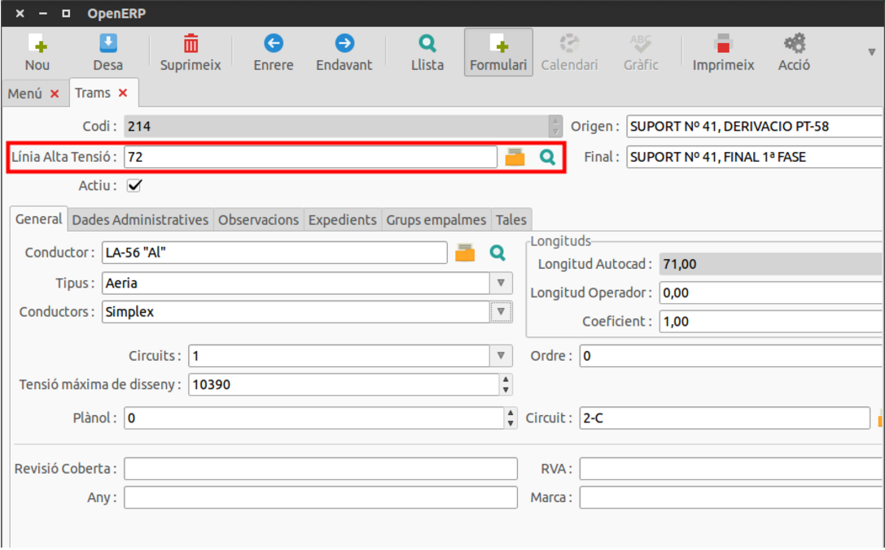
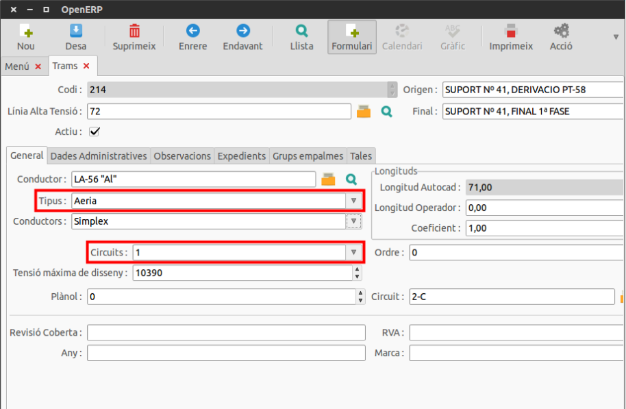
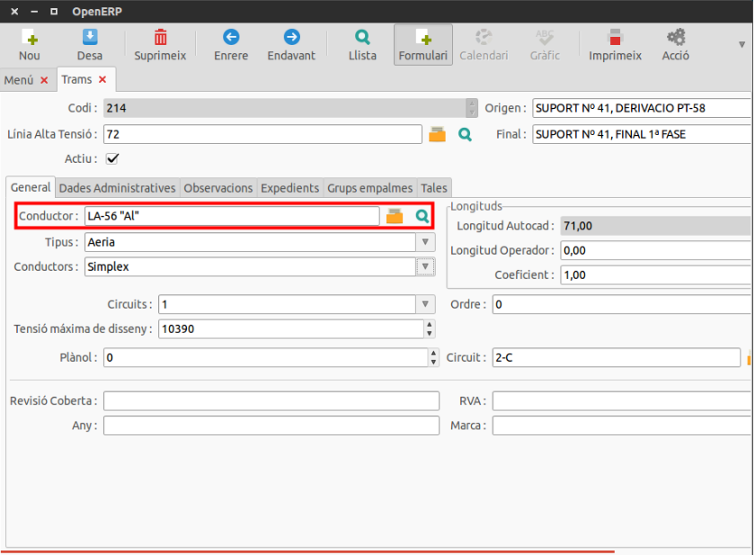
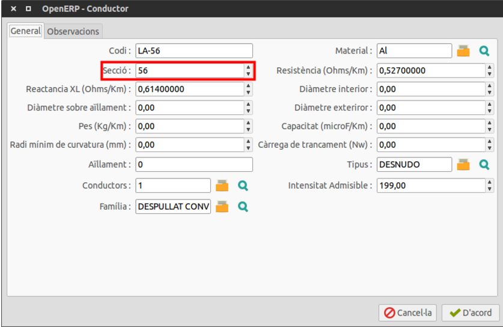
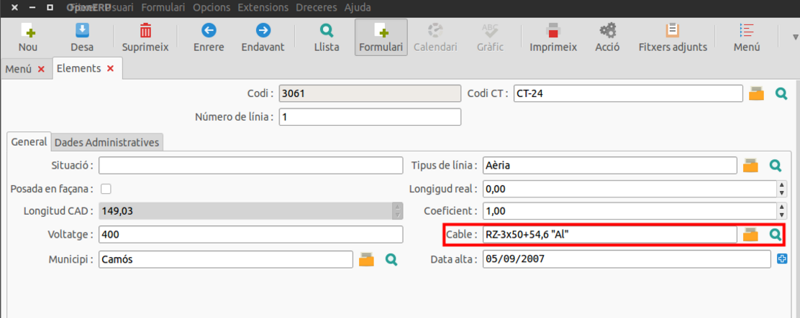
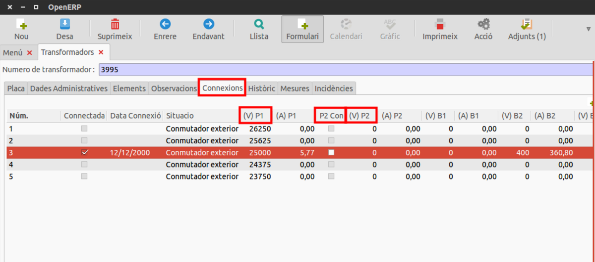
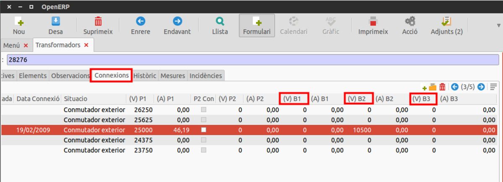
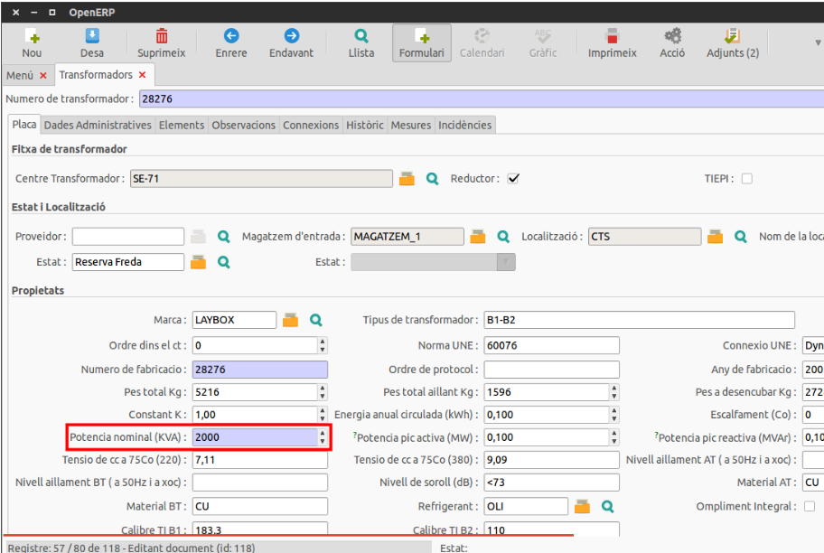
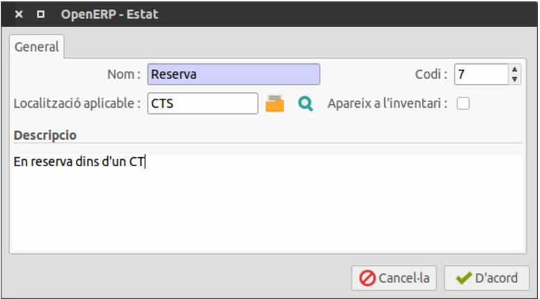

# Índex
1. [CINI Línies d'Alta Tensió](#1-cini-linies-dalta-tensio)
2. [CINI Línies de Baixa Tensió](#2-cini-linies-de-baixa-tensio)
3. [Transformadors](#3-transformadors)
4. [Centres transformadors](#4-centres-transformadors)
5. [Posicions](#5-posicions)
6. [Parcs de Distribució](#6-parcs-de-distribucio)
7. [Subestacions](#7-subestacions)
8. [Cel·les i elements de tall (Fiabilitat)](#8-celles-i-elements-de-tall-fiabilitat)

El document de referència de CINI serà la
[circular 4/2015](https://www.boe.es/boe/dias/2015/07/31/pdfs/BOE-A-2015-8624.pdf)

!!! Note
    Tots els CINI es poden bloquejar marcant la casella “Bloquejar CINI”,
    i tots els càlculs que aquí es descriuen deixaràn de tenir efecte i
    es mantindrà el CINI que li assigni l’usuari.

!!! Note
    Si al fer el càlcul del CINI, una de les posicions del CINI,
    no es pot calcular perquè el camp del que s’ha d’obtenir el valor
    està buit o fora del rang esperat, la posició apareixerà en **blanc**.

P.e. en aquest cas la 5a posició apareix en blanc perquè falta entrar
el valor del tipus de element de la CNMC, en la taula corresponent.

# 1. CINI Línies d'Alta Tensió

El CINI de cada tram d’Alta Tensió és calculat a partir de les dades del
propi tram i de les dades de la **línia d’AT** que té vinculada:

**Primera posició**: 2    
**Segona posició**: 0    
**Tercera posició**:

- S’obté del camp “**Tensió màxima de disseny**” del tram d’Alta Tensió.

Si el camp de la “**Tensió màxima de disseny**” del tram d’AT és buit o zero,
s’obté del camp “**Tensió**” de la **línia d’Alta Tensió**
associada al tram d’AT:

**Quarta posició**:

- Tensada sobre postes, un circuito = **1**: si el valor del camp
  **tipus de línia d’AT = Aeria** i el valor del camp **Circuits = 1**.
- Tensada sobre postes, doble circuito = **2**: si el valor del camp
  **tipus de línia d’AT = Aeria** i el valor del camp **Circuits = 2**.
- Tensada sobre postes, más de dos circuitos = **3**: si el valor del camp
  **tipus de línia d’AT = Aeria** i el valor del camp **Circuits > 2**.
- Subterránea, un circuito = **7**: si el valor del camp
  **tipus de línia d’AT = Subterranea** i el valor del camp **Circuits = 1**
- Subterránea, doble circuito = **8**: si el valor del camp
  **tipus de línia d’AT = Subterranea** i el valor del camp **Circuits = 2**
- Subterránea, doble circuito = **9**: si el valor del camp
  **tipus de línia d’AT = Subterranea** i el valor del camp **Circuits > 2**
- No es contemplen altres casos per les **línies d’Alta Tensió**.

**Cinquena posició**:

-El número de conductors s’obté del camp **conductors** del tramd’Alta Tensió:

**Sisena posició**:

- La secció s’obté del camp **Secció** del **Conductor** associat
  al tram d’Alta Tensió.

**Setena posició**:

- La tensió s’obté del camp **Tensió** de la **línia** vinculada al
  tram d’Alta Tensió, igual que a la **tercera posició**.

# 2. CINI Línies de Baixa Tensió

**Primera posició**: 2
**Segona posició**: 0
**Tercera posició**:

- La tensió s’obté del camp **Voltatge** de **l’element de Baixa Tensió**.

**Quarta posició**:

- En les línies de **baixa tensió**, el **número de circuits**
  té un valor fix de **1**.
- Tensada sobre postes, un circuito = **1**: si el valor del camp
  **Tipus de línia de BT = Aèria** i el camp **Posada en façana = desactivat**.
- Apoyada sobre fachada, un circuito = **4**: si el valor del camp
  **Tipus de línia de BT = Aèria** i el camp **Posada en façana = activat**.
- Subterránea, un circuito = **1**: si el valor del camp
  **Tipus de línia de BT = Subterrània**

**Cinquena posició**:

- **Símplex = 1**: el número de conductors en les
  **línies de Baixa Tensió** és de **1**.

**Sisena posició**:

- La secció s’obté del camp **Secció** del **Cable** associat
  **l’element de Baixa Tensió.**

**Setena posició**:

- La tensió s’obté del camp **Voltatge** de **l’element de Baixa Tensió**,
  igual que a la **tercera posició**.

# 3. Transformadors

**Primera posició**: 2    
**Segona posició**: 7    
**Tercera posició**:

- La tensió s’obté de la **connexió activa** de la
  pestanya **connexions del transformador**.
- S’obté del camp **(V) P1** si **P2 Con** està desactivat.
- Si **P2 Con** està activat, llavors agafa la tensió = **(V) P2**.

**Quarta posició**:
- La tensió s’obté de la **connexió activa** de la
  pestanya **connexions del transformador**.
- S’obté a partir dels camps **(V) B1, (V) B2** i **(V) B3**,
  dels quals obtindrà la que sigui superior.

**Cinquena posició**:

- en subestació = **1**: si el camp **Centre Transformador** del
  **transformador** és una **subestació**
- en un centre de transformació = **2**: si el **Centre Transformador**
  del **transformador** és un **CT**.

**Sisena posició**:

- La potència s’obté del camp **Potència nominal (KVA) del transformador**.

**Setena posició**:

- Trafo en funcionament = **0**: el camp **estat del transformador**,
  el valor del camp **codi = 1**
- Trafo de reserva = **1**: el camp **estat del transformador**,
  el valor del camp **codi = 7**
- Trafo móvil = **2**: No està contemplat.
- Qualsevol altre valor en el camp **estat del transformador**,
  que no està contemplat, **deixarà en blanc** la setena posició.

El CINI dels transformadors que es troben en el magatzem serà: **I2900600**.

# 4. Centres transformadors

**Primera posició**: 2    
**Segona posició**: 2    
**Tercera posició**: 4    
**Quarta posició**: 5    
**Cinquena posició**:

 **1.** Busca el valor del camp codi de la categoria CNE del tipus de CT.

Intemperie = **1** si el valor del camp **codi = I**
Caseta = **2** si el valor del camp **codi = C**
Local = **3** si el valor del camp **codi = L**
Subterraneo = **4** si el valor del camp **codi = S**
Movil = **4** , no aplica.

**Sisena posició:**

- S’obté a partir del camp **Tensió de primari [V]** /1000.

Adopta el valor que coincideix amb la tensió indicada del CINI,
i si no coincideix adopta el codi de la immediatament superior.

**Setena posició**:

La potència del centre transformador es calcularà com la suma de tots
els transformadors en estat **funcionament**.  Els de reserva, i els
de client i qualsevol altre estat no es tindran en compte.

Segons indica la circular 4771, a la pàgina 37859:

*“Si la potencia del centro de transformación de la tabla tipologías no*
*coincide con las indicadas, se seleccionará la inmediatamente superior.*
*Para Centros de transformación con dos máquinas de diferente potencia,*
*la potencia a seleccionar será la semisuma de las potencias*
*de las dos máquinas. De no coincidir con las potencias indicadas*
*en la Tipología, se elegirá el Tipo de maquina con la potencia*
*inmediatamente superior.*

*En caso de centros de transformación con tres o más máquinas se clasificará*
*como TI-000 (Instalación no asimilable).*

*Los centros de reparto, los centros de medida y los centros de seccionamiento*
*se  declararán como TI-000 (instalación no asimilable), asignándoles su CINI*
*correspondiente. Si dichos centros dispusieran de más de 4 posiciones,*
*la diferencia entre el número total de posiciones de ese centro y las 4*
*posiciones consideradas, deberán ser declaradas en el nodo*
*«posiciones equipadas con interruptor en subestaciones».*

*Todas las posiciones deben constar de interruptor.”*

!!! Note
    **Exemple:**
    Si el CT te una màquina de 315 kVA, com que els barems CNMC són 250KVA
    o 400KVA, hem d’agafar el valor immediatament superior (400 KVA),
    per tant el valor adoptat serà la H.

Quan hi hagin **dues màquines** el càlcul de la potència de la màquines
es farà fent la semisuma de les potencies de les dues màquines.

!!! Note
    **Exemple:**
    Si el CT te una màquina de 400 kVA i una de 630 kVA,
    1030/2= 515 el valor adoptat serà S 2x630 kVA

!!! Note
    **Exemple:**
    Si el CT te una màquina de 500 kVA i una de 1000 kVA,
    1500/2= 750 el valor adoptat serà T 2x1000 kVA.
    (és l’immediatament superior)

# 5. POSICIONS

**Primera posició**: 2    
**Segona posició**: 8    
**Tercera posició**:

- S’obté del camp “Tensió a aplicar” de la tensió de la posició:

!!! FALTA IMATGE

!!! FALTA IMATGE

**Quarta posició**:

- Posición con interruptor = **2**: si al camp “**Tipus interruptor**”
  de la posició = **Interruptor automàtic**
- Posición sin interruptor = **3**: si al camp “**Tipus interruptor**”
  de la posició = **Sense interruptor**

!!! FALTA IMATGE

**Cinquena posició**:

- Els valors per calcular el cinquè camp s’obtenen dels següents camps:
	- Camp **Tecnologia** de la posició
	- **Interior**: si el camp **Tipus** de la
    **subestació de la posició, l’id = ‘L’, ‘C’ o ‘S’**
	- **Intempèrie**: si el camp **Tipus** de la
    **subestació de la posició, l’id = ‘I’**

!!! FALTA IMATGE

!!! FALTA IMATGE

!!! FALTA IMATGE

**Sisena posició**:

- S’obté del camp “**funció**” de la posició. Si el valor del camp
  posició linia = **Altre**, la sisena posició del CINI **quedarà en blanc**.

!!! FALTA IMATGE

**Setena posició**:

- S’obté del camp “**Tensió a aplicar**” de la tensió de la posició,
  de igual forma que a la **tercera posició**.

# 6. PARCS DE DISTRIBUCIÓ

**Primera posició**: 2     
**Segona posició**: 8     
**Tercera posició**:

- S’obté del camp “**Tensió a aplicar**” de la tensió del parc:

!!! FALTA IMATGE

!!! FALTA IMATGE

**Quarta posició**: 1    
**Cinquena posició**:

- S’obté del camp “**Tecnologia**” del parc:

!!! FALTA IMATGE

**Sisena posició**:

- S’obté del camp “**Configuració**” del parc:

!!! FALTA IMATGE

**Setena posició**:

- S’obté del camp “**Tensió a aplicar**” de la tensió del parc,
  de igual forma que a la **tercera posició**.

# 7. SUBESTACIONS

**Primera posició**: 2     
**Segona posició**: 1    
**Tercera posició**:

- S’obté del camp “**Tensió primari**” de la subestació.

!!! FALTA IMATGE

**Quarta posició**:

- S’obté del camp “**Tensió secundari**” de la subestació:

!!! FALTA IMATGE

**Cinquena posició**:

- S’obté del camp “**Tecnologia**” de la subestació:
    1. Si **tecnologia = Convencional**
    2. Si **tecnologia = Blindada**
    3. Si **tecnologia = Mòbil**

!!! FALTA IMATGE

**Sisena posició**:

- Es sumen les potències nominals dels transformadors
  que estan en funcionament.    
  Es consideren en funcionament tots els transformadors
  que tinguin un codi d’estat = **1**.

!!! FALTA IMATGE

- Si no hi ha cap transformador en funcionament o la suma de potències és 0,
  es posarà el valor **Z** a la sisena posició.    
- Per cada transformador, la potència s’obté del camp
  **Potència nominal (KVA) del transformador**.

!!! FALTA IMATGE

**Setena posició**: posició no utilitzada = 0

# 8. CEL·LES I ELEMENTS DE TALL (Fiabilitat)

**CINI: I26** - element de fiabilitat    
**3a posició**: tensió normalitzada

!!! FALTA IMATGE

**4a posició**: sempre 0 zero    
**5a posició**:

!!! FALTA IMATGE

- Aquesta posició es calcula a partir del valor del camp
  **Tipus CNMC CINI** del catàleg de Tipo elemento.

!!! FALTA IMATGE

Que es troba al menú:

!!! FALTA IMATGE

**6a posició**:

- Per defecte sempre posarà **1**
    - A no ser que estigui marcat **Telemando**, llavors posarà **2**.

!!! FALTA IMATGE

**7a posició**:

1. Subestació
2. Centre de transformació.

!!! FALTA IMATGE

3. Tram de línia

!!! FALTA IMATGE
