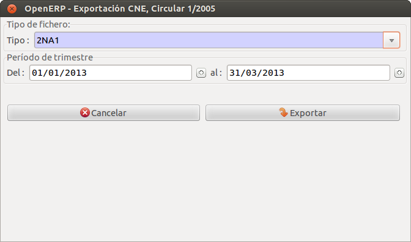
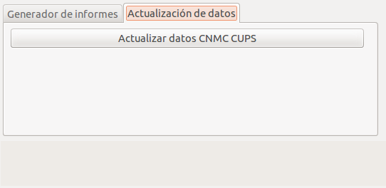
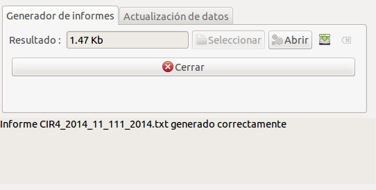

# Documentació dels mòduls de dins de CNMC

Continguts:

* [INF/DE/0066/44](#modul-per-generar-el-fixer-csv-segons-cnmc-infde006644-per-distribuidora)
* [Circular 1/2005](#circular-12005)
* [Circular 4/2014](#circular-42014)

## Mòdul per generar el fixer CSV segons CNMC INF/DE/0066/44 per distribuïdora

### Introducció

Per poder fer una auditoria de canvis de comercialitzadora, la CNMC demana un
CSV amb el format definit a INF/DE/0066/14

### Generació

Per generar el fitxer, hem d'executar l'assistent que trobarem a
**Administració pública > CNMC > Informe INF/DE/0066/14**

Només caldrà introduïr l'any del qual es vol fer l'informe, que per defecte ja
és 2013 i prèmer el botó **Exportar**.

Des de **Fitxer** es podrà obrie el CSV i descarregar-lo a disc

### Dades utilitzades

Per omplir el fitxer es tenen en compte totes les pólisses creades dins l'any
escollit que tinguin la corresponent modificació contractual de tipus `alta`.

Així doncs, el fitxer generat serà correcte si les altes a la comercialitzadora
es registren com a modificació contractual de la pòlissa de tipus `alta`
correctament.

| Nom del camp               | Valor del camp                                 |
|----------------------------|------------------------------------------------|
| **CODIGO_INFORMANTE**      | Camp `Codi R2` de la companyia                 |
| **CODIGO_CUPS**            | CUPS                                           |
| **FECHA_ACTIVACION**       | Data inici de la modificació contractual nova  |

!!! note
    Codi R2 (R2-xxx) de la CNMC gestionable en el camp `Ref2` de la fitxa de
    l'empresa comercialitzadora accessible des del menú `Empreses`

--------------------------------------------------------------------------------

## Circular 1/2005

El mòdul permet al GISCE-ERP la generació dels informes referents a la
circular 1/2005 de la CNE. Aquests informes venen definits per la mateixa **CNE**.

* [Anexo I: Instrucciones para completar la información solicitada en los
  formularios del Anexo II](https://sede.cne.gob.es/c/document_library/get_file?uuid=59598178-3f1c-47e5-98ee-b705b6c06397&groupId=10136)
* [Anexo II: Formularios de envío de información de la  CNE](https://sede.cne.gob.es/c/document_library/get_file?uuid=ce663590-4c7d-411a-b902-0f543c815b10&groupId=10136)
* [Anexo III: Tablas Circular 1/2005](https://sede.cne.gob.es/c/document_library/get_file?uuid=97fb83c3-dc74-40be-a5e2-fa8a813e29eb&groupId=10136)

### 1 Informe de sol·licituds de canvi de MR a ML i de comercialitzadora

**Informe trimestral.**

1. Omplim el camp de la secció 'tipus de fitxer' amb el valor '1' del desplegable.
2. Omplim els camps de la secció 'periode del trimestre' amb la data inicial i
   data final del trimestre.
3. Premem el botó 'exportar' per generar l'informe.
4. Quan s'ha generat l'informe apareix la secció 'nom del fitxer' on podrem
   escollir obrir o guardar l'informe.

En l'exemple hi ha les dates per generar l'informe del primer trimestre de l'any:

* Les dades s'extreuen dels canvis de comercialitzadora en les modificacions
  contractuals entre les data inicial i data final especificades en la secció
  'periode del trimestre', quan dues modificacions contractuals consecutives
  tenen diferent comercialitzadora.
* Només es tenen en compte els canvis de comercialitzadora de 'CUR' a 'NO CUR'
  i de 'NO CUR' a 'NO CUR'.
* Les dades s'agrupen per diferent tipus de punt de mesura.

### 2NA1 Informe de sol·licituds acceptades de canvi de comercialitzadora en funció del retràs fins a la data de canvi efectiu.

**Informe trimestral.**

1. Omplim el camp de la secció 'tipus de fitxer' amb el valor '2NA1' del
   desplegable.
2. Omplim els camps de la secció 'periode del trimestre' amb la data inicial i
   data final del trimestre.
3. Premem el botó 'exportar' per generar l'informe.
4. Quan s'ha generat l'informe apareix la secció 'nom del fitxer' on podrem
   escollir obrir o guardar l'informe.

En l'exemple hi ha les dates per generar l'informe del primer trimestre de l'any:

* Les dades s'extreuen dels canvis de comercialitzadora en les modificacions
  contractuals entre les data inicial i data final especificades en la secció
  'periode del trimestre', quan dues modificacions contractuals consecutives
  tenen diferent comercialitzadora.
* Només es tenen en compte els canvis de comercialitzadora de 'CUR' a 'NO CUR',
  de 'NO CUR' a 'NO CUR' i de 'NO CUR' a 'CUR'.
* Les dades s'agrupen per diferents comercialitzadores d'entrada i sortida,
  tipus de punt de mesura i tarifa d'accés.

### 5A Informe de classifació dels consumidors en funció del número de canvis efectuats de MR a ML.

**Informe semestral.**

1. Omplim el camp de la secció 'tipus de fitxer' amb el valor '5A' del desplegable.
2. Omplim els camps de la secció 'periode del trimestre' amb la data inicial i
   data final del trimestre.
3. Premem el botó 'exportar' per generar l'informe.
4. Quan s'ha generat l'informe apareix la secció 'nom del fitxer' on podrem
   escollir obrir o guardar l'informe.

En l'exemple hi ha les dates per generar l'informe del primer semestre de l'any:

* Les dades s'extreuen dels canvis de comercialitzadora en les modificacions
  contractuals entre les data inicial i data final especificades en la secció
  'periode del trimestre', quan dues modificacions contractuals consecutives
  tenen diferent comercialitzadora.
* Només es tenen en comtpe els canvis de comercialitzadora de 'CUR' a 'NO CUR'.
* Les dades s'agrupen per diferent tipus de punt de mesura.

### 5B Informe de classifació dels consumidors en funció del número de canvis efectuats de comercialitzadora.

**Informe semestral.**

1. Omplim el camp de la secció 'tipus de fitxer' amb el valor '5B' del desplegable.
2. Omplim els camps de la secció 'periode del trimestre' amb la data inicial i
   data final del trimestre.
3. Premem el botó 'exportar' per generar l'informe.
4. Quan s'ha generat l'informe apareix la secció 'nom del fitxer' on podrem
   escollir obrir o guardar l'informe.

En l'exemple hi ha les dates per generar l'informe del primer semestre de l'any:

* Les dades s'extreuen dels canvis de comercialitzadora en les modificacions
  contractuals entre les data inicial i data final especificades en la secció
  'periode del trimestre', quan dues modificacions contractuals consecutives
  tenen diferent comercialitzadora.
* Només es tenen en compte els canvis de comercialitzadora de 'NO CUR' a
  'NO CUR'.
* Les dades s'agrupen per diferent tipus de punt de mesura.

### 7NA Informe de classificació dels consumidors en funció del comercialitzador, tipus de punt de subministre, tipus de tarifa d'accés i la provincia on s'ubica el punt de subministrament.

**Informe trimestral.**

1. Omplim el camp de la secció 'tipus de fitxer' amb el valor '7NA' del desplegable.
2. Omplim el camp de la secció 'trimestre' amb la data final del trimestre.
3. Omplim els camps de la secció 'periode d'energia' amb la data inicial i la
   data final dels quatre últims trimestres anteriors al trimestre escollit en
   el camp de la secció 'trimestre'.
4. Premem el botó 'exportar' per generar l'informe.
5. Quan s'ha generat l'informe apareix la secció 'nom del fitxer' on podrem
   escollir obrir o guardar l'informe.

En l'exemple hi ha les dates per generar l'informe del primer trimestre de
l'any, amb els quatre últims trimestres anteriors al primer trimestre de l'any
com a periode d'energia:

* Les dades dels consumidors s'extreuen de les modificacions contractuals, on
  la data especificada a la secció 'trimestre' es troba entre les data inicial i
  data final de la modificació contractual.
* L'energia s'extreu de les factures, amb data de factura entre les data inicial
  i data final de la secció 'periode d'energia'.
* Ambdues es relacionen i s'agrupen per diferents comercialitzadores, tipus de
  punt de mesura, tarifa d'accés i provincia.

--------------------------------------------------------------------------------

## Circular 4/2014

### Introducció

Aquest mòdul permet la generació dels formularis F1, F1bis i F11 de la Circular
4/2014

!!! note
    Aquest mòdul va ser afegit a partir de la versió **v2.44** on es van afegir un
    sèrie de camps nous a la base de dades per tal de cumplimentar la informació
    requerida en els formularis

### Nous camps a la base de dades

#### CUPS

!!! note
    Tots els camps referents a dades de la **CNMC** s'han mogut a una pestanya
    anomendada **Estadistiques** dins del formulari del CUPS.

S'han afegit nous camps estadístics de la CNMC:

* **Número de lectures (CNMC)**: És el número de lectures efectuades en el CUPS
  en l'any de generació de la circular.
* **Potència facturada (CNMC)**: És l'última potència facturada a aquest CUPS en
  l'any de generació de la circular.

#### Comptador

S'afegeix el codi CINI al comptador

* **Bloquejar CINI**: Un cop assignat un CINI de forma manual ens permet
  bloquejar-lo per tal d'evitar una modificació.
* **CINI**: És el codi CINI d'aquest comptador.
* **Calcular CINI (auto.)**: Aquest camp permet el càlcul del codi CINI mitjançant
  el lloguer del comptador.

!!! note
    El sistema de càlcul de CINI automàtic només està disponible utilitzant el
    mòdul de facturació de distribució de GISCE-ERP.

Es poden visualitzar tots els comptadors que no disposen de CINI entrat a través
del menú: **Infraestructura > Comptadors > Comptadors sense CINI**

**Càlcul CINI automàtic segons el lloguer**

S'ha realitzat una taula d'equivalència entre els lloguers dels comptador i els
CINIS:

Codi de lloguer |  CINI
:--------------:|:------:
   ALQ01        | I31011A
   ALQ02        | I31011B
   ALQ03        | I31011C
   ALQ04        | I31011G
   ALQ05        | I31011H
   ALQ06        | I31011D
   ALQ07        | I31011E
   ALQ08        | I31011F
   ALQ14        | I31011K
   ALQ15        | I31011L
   ALQ16        | I31011N
   ALQ17        | I31011O
   ALQ18        | I31011P
   ALQ19        | I31013P
   ALQ20        | I31013Q
    (\*)        | I31011U

(\*) L'utilitza per tota la resta que no pot identificar a través del producte
de lloguer, ja sigui perquè no el té definit o perquè no correspont a cap
codi dels anteriors.

Si el comptador té seleccionat que la propietat és de **client** es marcarà la
posició 5 del CINI automàticament amb 2.

Si es té activat el mòdul de **telegestió** GISCE-TG, es detectarà es marcarà
la posició 6 del CINI automàticament amb 3.

#### Centre transformador

Se ha añadido el campo **Número máximo de máquinas**

!!! note
    En el procés d'actualització aquest camp s'inicialitza de forma automàtica
    segons el número de transformadors instal·lats el CT. Després s'ha de
    **revisar** que el valor sigui el corresponent.

### Generació dels informes

Els informes es poden generar a través del menú: **Administració pública >
CNMC > Circulares > Circular 4/2014**

A través d'aquest assistent podem realitzar dues operacions:
  1. Generar els informes
  2. Actualitzar dades estadístiques de la CNMC que s'utilitzen en aquests
     informes

!!! note
    Abans de generar els informes, hem d'haver actualtizat les dades de la CNMC
    amb l'aque que volem realitzar l'informe.

#### Actualització de dades

Aquesta pestanya és diferent segons es tingui instal·lat el mòdul de facturació
de distribució de GISCE-ERP o no.

**Amb mòdul de facturació**

En el cas que el tinguem instal·lat, només ens apareix un botó per recalcular aquest
valors depenguent de l'any que tinguem introduït en la pestanya "Generador d'informes".

**Sense mòdul de facturació**

Tenim dues accions disponibles:
  * **CUPS CSV**: Hem de seleccionar el fitxer CSV amb el contingut adequat per
    tal d'actualitzar els valors CNMC del CUPS i després apretar el botó
    **Actualitzar CUPS**. Veure el [format de les cups en el
    csv](#format-cups-csv)
  * **Comptadors CSV**: Hem de seleccionar el fitxer CSV amb el contingut
    adequat per tal d'actualitzar els CINIS dels comptadors i després apretar el
    botó **Actualitzar CINIS**. Veure el [format dels comptadors en
    els csv](#format-comptadors-csv)

#### Generació dels informes

* **Formulari**: Ens permet seleccionar quin informe volem generar. Els
  disponibles són: F1, F1bis i F11.
* **Any del càlcul**: En quin any volem realitzar el càlcul. Aquest camp també
  ens serviex per l'actualització de dades del CUPS.
* **Codi R1**: Em d'introduïr el codi R1 de la nostra empresa, només els 3 digits.
* **Núm. Procesos**: Hem de seleccionar el número de processos que volem
  utilitzar alhora de generar l'informe.

Podem apretar el botó **Generar el ficher** per tal que comenci el procés de
generació de l'informe.

!!! note
    Depenguent de la quantitat de dades els informes poden tardar força temps
    en generar-se.

Una vegada hagi finalitzat el procés podrem descarregar l'informe geneat

### Fitxers d'intercanvi

Pels usuaris de GISCE-ERP que no utilitzin el mòdul de facturació de distribució
es defineixen uns fitxers d'intercanvi per actualitzar dades referents als
formularis amb següent format.

### Format CUPS CSV

* Sense capçalera
* Columnes separades per punt i coma ( **;** ) i sense cometes.

 Camp                             | Descripció
:---------------------------------|:-----------------------------------------------
 CUPS                             | Codi universal del punt de subministrament
 Energia activa anual consumida   | Energia activa facturada el 2013
 Energia reactiva anual consumida | Energia reactiva facturada el 2013
 Potencia facturada               | Potencia facturada el mes 12 any circular o si la pòlisa està de baixa, l'últim mes facturat
 Número de lecturas any circular  | Número de lectures d'activa efectuadas en l'any de la circular.

### Format Comptadors CSV

* Sense capçalera
* Columnes separades per punt i coma ( **;** ) i sense cometes.

 Camp            | Descripció
:----------------|:-----------------------------
 Número de sèrie | Número de sèrie del comptador
 CINI            | Codi CINI del comptador
