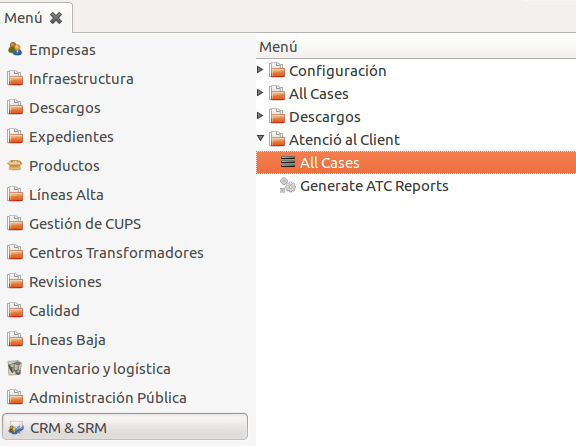

# Documentació dels mòduls de dins de CNMC

Continguts:

* [INF/DE/0066/44](#modul-per-generar-el-fixer-csv-segons-cnmc-infde006644-per-distribuidora)
* [Circular 1/2005](resoluciones/circular_1-2005.md#circular-12005)
* [Circular 4/2014](resoluciones/circular_4-2014.md#circular-42014)
* [Circular 4/2015](resoluciones/circular_4-2015#circular-42015)
* [Circular 2/2016](#generacio-de-informes-sobre-reclamacions-de-consumidors)
* [Inventari 4666](resoluciones/4666.md#inventari-4666)

## Mòdul per generar el fixer CSV segons CNMC INF/DE/0066/44 per distribuïdora

### Introducció

Per poder fer una auditoria de canvis de comercialitzadora, la CNMC demana un
CSV amb el format definit a INF/DE/0066/14

### Generació

Per generar el fitxer, hem d'executar l'assistent que trobarem a
**Administració pública > CNMC > Informe INF/DE/0066/14**

Només caldrà introduïr l'any del qual es vol fer l'informe, que per defecte ja
és 2013 i prèmer el botó **Exportar**.

Des de **Fitxer** es podrà obrie el CSV i descarregar-lo a disc

### Dades utilitzades

Per omplir el fitxer es tenen en compte totes les pólisses creades dins l'any
escollit que tinguin la corresponent modificació contractual de tipus `alta`.

Així doncs, el fitxer generat serà correcte si les altes a la comercialitzadora
es registren com a modificació contractual de la pòlissa de tipus `alta`
correctament.

| Nom del camp               | Valor del camp                                 |
|----------------------------|------------------------------------------------|
| **CODIGO_INFORMANTE**      | Camp `Codi R2` de la companyia                 |
| **CODIGO_CUPS**            | CUPS                                           |
| **FECHA_ACTIVACION**       | Data inici de la modificació contractual nova  |

!!! note
    Codi R2 (R2-xxx) de la CNMC gestionable en el camp `Ref2` de la fitxa de
    l'empresa comercialitzadora accessible des del menú `Empreses`

--------------------------------------------------------------------------------

## Fitxers d'intercanvi

Pels usuaris de GISCE-ERP que no utilitzin el mòdul de facturació de distribució
es defineixen uns fitxers d'intercanvi per actualitzar dades referents als
formularis amb següent format.

### Format CUPS CSV

* Sense capçalera
* Columnes separades per punt i coma (**;**) i sense cometes.
* El separador de decimals de les **energies i la potencia** serà un
 **punt (.)**

Camp                             | Descripció
:--------------------------------|:----------------------------------------------
CUPS                             | Codi universal del punt de subministrament
Energia activa anual consumida   | Energia activa anual facturada el 2014
Energia reactiva anual consumida | Energia reactiva anual facturada el 2014
Potencia facturada               | Potencia facturada el mes 12 any circular o si la pòlisa està de baixa, l'últim mes facturat
Número de lecturas any circular  | Número de lectures d'activa efectuadas en l'any de la circular.

### Format Comptadors CSV

* Sense capçalera
* Columnes separades per punt i coma (**;**) i sense comentes.

Camp            | Descripció
:---------------|:----------------------------------------------
Número de sèrie | Número de sèrie del comptador
CINI            | Codi CINI del comptador

## Generació de Informes sobre Reclamacions de Consumidors

La principal funcionalitat del modul d'Atenció al Client és la de poder generar de forma
automatitzada fitxers amb la informació sobre les reclamacions demanats per la
CNMC. Es tracta de un fitxer .csv el format i la informació del qual segueixen
les directrius definides en la circular [2/2016](http://www.boe.es/diario_boe/txt.php?id=BOE-A-2016-7979).

Mitjançant la opció "**Generate ATC Reports**" situada a  "**CRM -> Atenció al
Client**"  s'obrirà un assitent per generar l'informe:

Aquest assistent funciona de la següent manera:

* Es selecciona un trimestre i un any (per defecte seran el trimestre i l'any
  actuals) i es clica "**Generar**".

* Automàticament es generarà un fitxer '.csv' amb tota la informació sobre les
  reclamacions. Aquest fitxer es pot obrir o guardar.

* Al guardar el fitxer s'assignarà un nom amb el següent format:

        "AAAA-MM-DD_electricidad_reclamaciones.csv"

     on AAAA-MM-DD és la data en que s'ha generat l'informe. Aquest nom no s'ha
     de modificar ja que és el demanat per la CNMC.

Les reclamacions que son incloses en aquest informe son totes aquelles
corresponents als casos d'atenció al client que no estiguin en estat 'esborrany'
i que pertanyin al trimestre i any seleccionats.

Al trobar-nos en una distribuidora, també s'inclouran les reclamacions
corresponents als casos **R1** de **Gestió ATR** que ja tinguin un pas 02 creat
(es a dir, que ja han estat  acceptats o rebutjats per la ditribuidora).

En la situació en que els casos R1 tenen un pas 02 amb rebuig s'indicarar en
l'informe que el resultat de la reclamació és "No Gestionable".    
Per altra banda, si ja s'ha tancat el cas ATR sense haver generat un pas 02 amb
rebuig s'indicarà el resultat de la reclamació com a "Procedente / Favorable".
