# Continguts

* [Documentació del mòdul de comptadors](#documentacio-del-modul-de-comptadors)
* [Documentació de lectures per distribuïdores](#documentacio-de-lectures-per-distribuidores)

# Documentació del mòdul de comptadors

A la fitxa de un comptador s'hi pot accedir per dos llocs diferents:

* **Menú / infraestructura / comptadors**
* **Pólissa**, pestanya **comptadors** on apareix el llistat de tots els comptadors
  actius i no actius que ha tingut aquesta pólissa

## Pestanya General de la fitxa de comptadors

* **Nº de serie**: És el número que identifica el comptador i al que
  s'associen les lectures, és el que veu el lector quan va a camp
* **Nº de serie (magatzem)**: Es pot associar un número de sèrie de un producte
  del magatzem. Aquest número de serie anirà associat a un producte. Per més
  informació, mireu el mòdul de productes i magatzem
* **Producte**: Aquest camp de només lectura mostra el producte al qual està
  associat el **Nº de sèrie (magatzem)**, en el cas que existeixi. Si no, es
  mostra en blanc.
* **Tensió**: Valor numèric que indica la tensio de l'equip de mesura.
* **Lloguer**: Quan s'activa aquesta casella, indiquem que al comptador se li
  ha de cobrar lloguer, ja sigui d'ICP, comptador, ambdos, etc. Si està
  activada aquesta casella apareix a sota el camp **Producte de lloguer**, si
  no, no
* **Producte de lloguer**: En aquest camp se li indica el producte de lloguer
  que se li cobrarà mensualment. (Veure el mòdul de productes). Es poden fer
  escandalls amb varis productes (comptador+ICP), etc .
* **Gir**: Aquest camp indica el valor màxim al qual arriba el comptador i
  torna a reiniciar-se a 0.
* **Propietat de**: En aquest quadre de selecció s'ha d'escollir si el
  comptador es de la empresa distribuïdora o del client
* **Data alta**: S'ha d'indicar la data de alta del comptador (Veure `Nota`)
* **Actiu**: Aquest camp indica si el comptador està actiu a la pólissa a la
  qual està associada. Quant es desitja donar de baixa un comptador, es
  desmarca aquesta casella i apareix a sota el camp **Data de baixa**
* **Data de baixa**: En aquest camp s'indicarà a quina data es dona de baixa el
  comptador en aquesta pólissa. Hi haurà d'haver una lectura a la data de baixa
  del comptador
* **Reanomenar**: Aquest botó permet canviar el **Nº de sèrie** del comptador
  en el cas que s'hagi produit un error al crear-lo. Les lectures també
  quedaran associades al nou número de sèrie del comptador
* **Introduïr lectures**: Aquest botó permet entrar les lectures de forma
  manual des de la fitxa del comptador

!!! note
    La *data de primera lectura* ha de conincidir amb la *data de alta del
    comptador*

## Donar d'alta un Comptador

Ens situem a la fitxa de la pòlissa a la que volem afegir el comptador. Allà,
anem a la pestanya _Comptadors_ i polsarem el botó _Nou_ tal i com s'indica
en la imatge següent:

!!! Todo

Apareixerà la fitxa del comptador que ha de cumplimentar-se com es descriu més
endavant. S'ha d'emplenar també el camp informatiu _N comptador_ de la part
superior. Sempre ha de conincidir amb el número de série del comptador actiu.

!!! Todo

+ **Nº de serie**: S'ha d'indicar el número de série del comptador. Si el
  comptador ja ha estat donat d'alta en alguna altra ocasió, el número de série
  haurà de buscar-se en la llista amb la _lupa_. En el cas que el comptador
  sigui nou, s'haurà de donar d'alta el número de série amb el botó _Nou_
+ **Comptador**: Aquest camp no s'ha d'emplenar momentàniament fins que es pogui
  relacionar amb un producte del mòdul de "_Productes_"
+ **Producte**: En aquest camp  s'ha d'indicar el lloguer a cobrar en la llista
  de lloguers que tingui la companyia. La Gestió dels lloguers es pot veure en
  l'apartat de [Lloguers](#lloguer-de-comptadors).
+ **Lloguer**: Si la casella està marcada, es cobrarà el lloguer descrit en el
  camp _Producte_.    
      Si està desmarcada, no es cobrarà cap lloguer.
+ **Gir**: En aquest camp s'indica numéricament en quin valor el comptador es
  reinicia a 0.

    !!! Note
        Si es un comptador amb 5 rodes, s'ha d'indicar el valor de la casella
        _Gir_ amb 100.000. Quan el comptador arribi a 99.999, el següent valor
        serà 0.

    El progama fa els càlculs dels consums, tinguent en compte el gir del
    comptador indicat en aquest camp.    
    Quan la lectura actual es inferior a la anterior, aplica el valor del gir
    per fer el càlcul correctament.    

    !!! Warning
        Es important que aquest camp sigui cumplimentat correctament.

+ **Constant de multiplicació**: Per defecte aquest valor serà 1. Per equips
  antics en els que la constant sigui diferent de 1, s'haurà d'indicar el valor
  de multiplicació dels valor de lectura introduïts.
+ **Data d'Alta**: Aquesta data es la que es tindrà en compta alhora de facturar
  els termes de potència. Si la data d'alta es el 15-01-2010 i la següent
  facturació es el 31-01-2010, es facturarà la part proporcional de la potencia
  als 16 dies d'estar donat d'alta.

    !!! Note
        Aquesta data també és important per la generació dels perfils de consum.

+ **Actiu**: El comptador que es dona d'alta ha d'estar sempre actiu.    
  Estaràn desactivats els demés comptadors que ja no estàn en funcionament en la
  pòlissa en qüestió
+ **Data de Baixa**: Es la data en que un comptador deixa d'estar associat a
  una pòlissa.    
  El comptador que el substitueix ha d'estar donat d'alta el dia següent al de
  la baixa del comptador anterior, així facturarà correctament el terme de
  potència.

Una vegada s'ha donat d'alta el comptador s'ha d'introduïr les [lectures
inicials del comptador](#introduccio-de-lectures).

## Donar de baixa un comptador

Existeixen 3 casos en els que s'hagi de donar de baixa un comptador:

1. Quan la pòlissa es dona de baixa i es retira el comptador.
2. Quan es realitza un canvi de comptador i es substitueix per un altre.
3. Quan es produeix un [canvi de tarifa o periodes de lectura](#canviar-de-3-a-6-periodes-de-lectures-en-tarifes-30a-i-31a).

## Lloguer de comptadors

!!! Todo

Amb el programa base, venen predefinits els preus dels productes de lloguer que
tenen els codis de ALQ1 a ALQ18 segons el decret vigent.

Els preus dels lloguers del ALQ14 al ALQ18 els ha d'indicar la pròpia companyia.

La pròpia companyia podrà crear nous lloguers, i aplicar els preus d'aquests.   
També podrà crear nous productes com a combinació de diversos productes
basant-se en els escandalls dels productes de GISCE-ERP. En la següent imatge
es poden veure combinacions de diferents lloguers combinats. El preu d'un
lloguer combinat s'autocaclcula com la suma dels seus productes base.

!!! Todo

## Canviar de 3 a 6 periodes de lectures en tarifes 3.0A i 3.1A

Si fins una determinada data s'han estat prenent lectures d'una pòlissa amb
tarifa 3.0A i 3.1A en tres periodes i es desitja fer el canvi a 6 periodes s'ha
de procedir com si fos un canvi de comptador, però mantenint el número de série.

El resultat final ha de ser tal i com es mostra en les següents imatges:

!!! Todo

!!! Note
    S'observa que en data XX/XX/XXXX es dona de baixa el comptador amb el que es
    realitzaven les lectures en 3 periodes.    
    en data XX/XX/XXXX es dona d'alta el nou comptador amb el mateix número de
    serie i s'inicialitza ja amb les lectures en 6 periodes.    
    En les següents imatges s'observa les lectures en data XX/XX/XXXX dels dos
    comptadors.

!!! Todo

!!! Note
    S'observa que les lectures tant d'activa com de reactiva estan en tres
    periodes. Aquest es el comptador que es dona de baixa el XX/XX/XXXX.

!!! Todo

!!! Note
    En el nou comptador, que es l'actiu, s'observa que les lectures inicials a
    XX/XX/XXXX estan fetes en 6 periodes i que la suma de P1+P4 es igual a la
    del P1 del comptador anterior, igual que amb P2+P5 són iguals al P2
    anterior, i la P3+P6 es igual al P3 del comptador amb 3 periodes.

## Com es fa un canvi de comptador a mig període de facturació?

Suposem que el dia 13/10/2011 es canvia el comptador amb el **nº de sèrie**
1000 per el comptador amb **nº de sèrie** 1001. Si i no hi ha cap més canvi de
tarifa ni de potència contractada no tindrem modificació contractual del dia
13/10/2011.

* **Al comptador antic** (1000) se li afegiran les lectures del dia anterior
  (12/10/2011) i es donarà de baixa (**Data de baixa**) el mateix dia
* **Al comptador nou** (1001) se li afegiran les lectures inicials del mateix
  dia (13/10/2011) de alta (**Data Alta**)

--------------------------------------------------------------------------------

# Documentació de lectures per distribuïdores

Continguts:

* [Introducció de lectures](#introduccio-de-lectures)
* [Comparativa de consums](#comparativa-de-consums)
* [Compra i magatzem de comptadors](#compra-i-magatzem-de-comptadors)

## Introducció de Lectures

Existeixes diversos mètodes per l'entrada de lectures de comptadors. A partir
de les lectures obtingudes per TPL, entrada manual per ruta, entrada de lectures
per número de comptador.

Les lectures inicials d'un comptador s'entren des del menú: "_Mení → Facturació
→ Lectures → Introduïr lectures per comptador_".

El procés es descriu a continuació:

1. Es sel·lecciona el número de comptador que s'acaba de donar d'alta en una
   pòlissa.
2. Una vegada localitzat es prem el botó _Continuar_.
3. Es comproba que el client, la tarifa i la potència contractada siguin
   correctes. En el camp data s'introduirà la data de la última facturació que
   s'ha realitzat depenent de si la tarifa és bimestral o mensual.

    !!! Note
        Si es dona d'alta el comptador en data 01/02/2010:

        * Si la pòlissa és bimestral, la lectura s'introduirà en data
          31/12/2009, que és la última dels bimestrals.
        * Si la pòlissa es factura mensualment, la data de la lectura inicial
          del comptador seria 31/01/2010.

    !!! Note
        La _hora_ de la lectura es pot introduïr segons dos opcions:

        * Si el tancament és _Manual_ la hora és 12:00.
        * Si la lectura es pren amb _Tancament_, la hora de lectura és 00:00.

    Seguidament es polsarà el botó _Introduir Dades_.

4. S'introdueixen els valors corresponents al maxímetre, i els valors del
   comptador d'activa i reactiva de cada un dels periodes, polsant el botó
   _Guardar i següent_

5. Si s'accedeix al comptador desde la pestanya _comptadors_ de la fitxa de la
   pòlissa, s'observa el resultat de la inicialització del comptador.

!!! tip
    Veure la [importació i exportació de lectures de TPL](tpl.md)

## Comparativa de consums

### Introducció

Es tracta de comparar el consum actual, en base a les lectures introduïdes al
ERP abans de facturar, amb els consums de les factures del mes anterior (n-1) i
del mateix mes de l'any anterior (n-12).

En aquest manual s'explica com generar una exportació de les comparatives
de lectures per un mes concret.

* [Com exportar un fitxer](#com-exportar-un-fitxer)
* [Camps del fitxer](#camps-del-fitxer)

El fitxer exportat contindrà la informació de consum actual del mes indicat
amb la comparativa de l'anterior factura i la de fa un any.

Per poder realitzar les comparatives entre diferents consums i donat que aquests
poden tenir diferent número de dies, s'ha procedit a calcular el consum diari.
Aquest és la divisió entre el consum i el número de dies d'aquest i així obtenir
una homogenització del consum entre períodes diferents i poder fer-ne una comparació
molt més acurada.

### Com exportar un fitxer

Per accedir a generar l'exportació cal anar a
**Facturació > Lectures > Exportació comparativa de lectures**.

En el formulari que apareixerà a continuació s'ha d'indicar el mes que es vol
fer la comparativa amb el següent format: **mm/yyyy**.

Un cop introduit el mes desitjat s'ha de clicar el botó d'exportar i aquest
generarà el fitxer amb les comparatives.

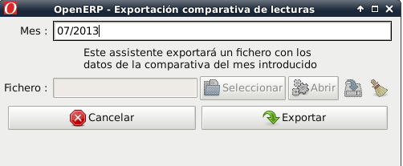

### Camps del fitxer

A continuació es descriu cada un dels camps del fitxer:

* **Pòlissa**
    Número de pòlissa.

* **Data_última_lectura**
    Dia de l'última lectura del mes indicat.

* **Dies_última_lectura**
    Dies que hi ha entre l'última lectura i la data final de la factura anterior.

* **Consum_actual**
    Consum que hi ha des de l'anterior factura a l'última lectura.

* **Consum_diari_actual**
    Proporció entre el *Consum_actual* i els *Dies_última_lectura*.

* **%_n-1**
    Comportament en percentatge entre el *Consum_diari_actual* i *Consum_diari_factura_anterior*.
    (Per exemple: un -25%, significa que el consum actual és un 25% menor al
    consum de la factura anterior.)

* **%_n-12**
    Comportament en percentatge entre el *Consum_diari_actual* i *Consum_diari_factura_any_anterior*.
    (Per exemple: un 14%, significa que el consum actual és un 13% superior al
    consum de la factura de l'any anterior)

* **Data_inici_factura_anterior**
    Data d'inici de la factura anterior.

* **Data_final_factura_anterior**
    Data final de la factura anterior.

* **Dies_factura_anterior**
    Dies entre la *Data_inici_factura_anterior* i *Data_final_factura_anterior*.

* **Consum_factura_anterior**
    Consum que es va facturar en la factura anterior.

* **Consum_diari_factura_anterior**
    Proporció entre el *Consum_diari_factura_anterior* i els
    *Dies_factura_anterior*.

* **Data_inici_factura_any_anterior**
    Data d'inici de la factura de l'any anterior al mes indica al mes indicat.

* **Data_final_factura_any_anterior**
    Data final de la factura de l'any anterior al mes indica al mes indicat.

* **Dies_factura_any_anterior**
    Dies entre la *Data_inici_factura_any_anterior* i *Data_final_factura_any_anterior*.

* **Consum_factura_any_anterior**
    Consum que es va facturar en la factura de l'any anterior.

* **Consum_diari_factura_any_anterior**
    Proporció entre el *Consum_diari_factura_any_anterior* i els
    *Dies_factura_any_anterior*.

---------------------------------------------------------------------------------

## Compra i magatzem de comptadors

### Introducció

En aquest manual s'explica el mòdul de magatzems de GISCE-ERP per a la gestió
de comptadors. Concretament:

* [Producte comptador](#producte-comptador)
* [Compra de comptadors](#compra-de-comptadors)
* [Recepció de lots amb números de sèrie correlatius](#recepcio-de-material-amb-numero-de-serie)

La gestió dels comptadors d'aquesta forma ens permet la seva traçabilitat, la
gestió del seu stock i localització i la gestió dels números de sèrie. Tot
aquest procés és **imprescindible**  pels comptadors de telegestió que
s'utilitzin en el mòdul de telegestió de GISCE-ERP

El flux general, i pels comptadors en particular, seria el següent:

1. Donar d'alta el *producte* comptador segons fabricant i model
2. *Comprar* un determinat nombre de comptadors fent la petició de compra
   corresponent
3. *Rebre* els comptadors i assignar-los el número de sèrie
4. Assignar el *número de sèrie* , i per tant producte, als comptadors del menú
   **Infraestructura**

blockdiag {
    "Orden de compra" -> Confirmar
    Confirmar -> "Aceptada por proveedor" [label = "OK"]
    "Aceptada por proveedor" -> Recepción [label = "paquete"]
    Recepción -> "Asignación de Nº de série" [label = "albarán"]
    "Asignación de Nº de série" -> "Asociar a contador" [label = "install"];
}

### Producte comptador

El primer pas per poder gestionar els comptadors correctament és donar-los
d'alta a la base de dades de productes. Podem accedir a la fitxa de productes
des del menú **Productes**. Per crear o cercar el producte, és millor anar a la
categoria de producte corresponent des del menú **Productes per categoria**

!!! tip
    Es recomana crear una categoria de producte **Comptador** o **Equips de
    mesura** per tenir localitzats els comptadors.

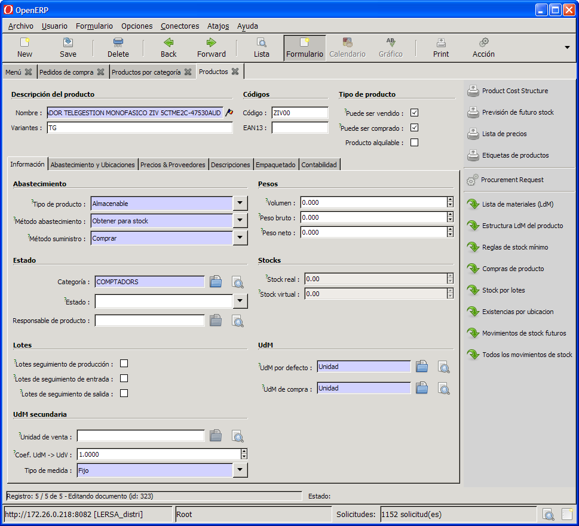

A la figura podem veure els camps de la fitxa de producte

És molt important que els impostos de client i proveïdor estiguin introduïts
correctament. (A la imatge es mostra l'IVA vigent en aquell moment)

!!! tip
    Quan es creen productes, es recomana duplicar un producte de la mateixa
    categoria que tingui tots els camps omplerts i així s'estalvia temps de
    creació del producte. S'ha de fer des de **Formulari > Duplicar**
    Un cop duplicat s'han de canviar el *nom de producte*, el *codi*, el *preu*,
    la *referència del proveïdor* i el *proveïdor* quan sigui necessari.

La fitxa de producte es pot completar amb la pestanya **Preus & proveïdors** on
s'hi indicarà el preu de cost, els possibles proveïdors, els noms i les
referències de cada proveïdor per aquest producte.

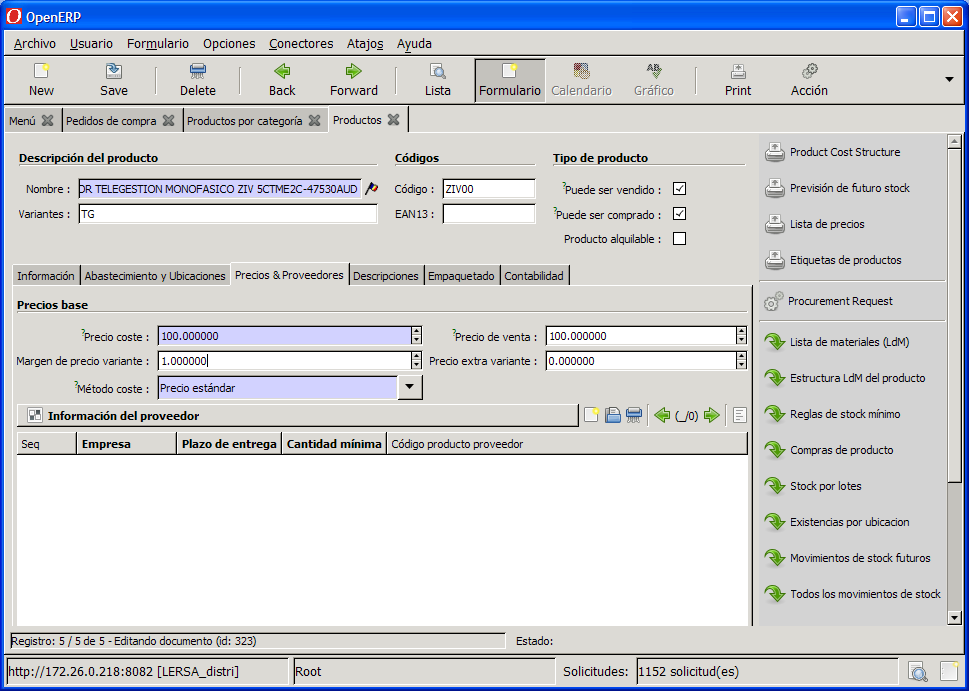

####Pestanya preus i proveïdors de la fitxa de producte

* **Preu cost**: És el preu que s'utilitzarà a l'ordre de compra d'aquest
  producte
* **Mètode de cost**: Si en aquest camp es posa *Preu mig* (serà el més
  habitual) el preu de compra s'anirà actualitzant a partir dels diferents
  preus de compra que es vagin donant.

Les dades de les pestanyes **Proveïments i Ubicacions**, **Descripcions** i
**Empaquetament** són dades informatives del producte, per tant no és
obligatori que estiguin omplertes.

### Compra de comptadors

Es descriu com realitzar l'ordre de compra dels comptadors i la recepció del
material en el magatzem.

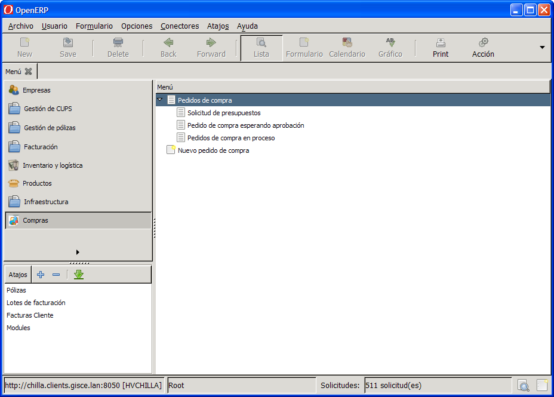

#### Mòdul de compres

Per començar es selecciona el menú **Compres > Comandes de compra > Sol·licitud
de presupostos**

#### Sol·licitud de pressupost

Prement el botó **Nou**

#### Nova ordre de compra

creem una nova ordre de compra i primer omplim els camps tal com es veu a la
imatge

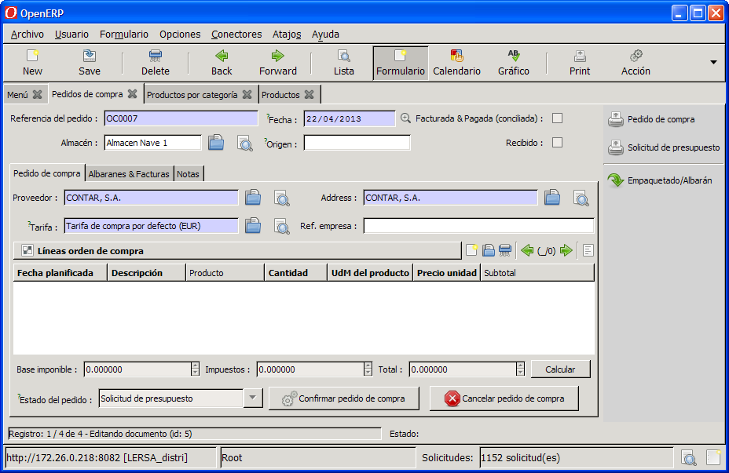

#### Fitxa de sol·licitud de compra

S'ompliran com a mínim els camps de color blau:

* **Ref. ordre**: Aquest camp s'omple automàticament quan es guarda l'ordre de
  compra
* **Magatzem**: S'indicarà el magatzem previst d'entrada de material
* **Data**: Data de sol·licitud del pressupost
* **Empresa**: Amb la lupa, seleccionem l'empresa a la qual es farà la
  sol·licitud de pressupost o la comanda directament
* **Direcció**: S'indicarà a quin comercial de l'empresa escollida se li farà
  la sol·licitud
* **Llista de preus**: S'indica la llista de preus que s'utilitzarà per obtenir
  els preus del producte. Per defecte, si no s'ha creat una llista de preus
  específica es farà servir la *"Default purchase list"* o llista de preus per
  defecte
* **Referència de l'ordre**: Camp informatiu en el cual es pot anotar la obra a
  la qual van dirigits els materials o deixar-la en blanc
* **Referència de l'empresa**: Si la comanda ha de portar alguna referència
  interna de la companyia es posa en aquest camp. Si no, es pot deixar en
  blanc.

Un cop omplert l'encapçalament de la sol·licitud de pressupost amb aquestes
dades es poden omplir les línies de la sol·licitud de pressupost seleccionant,
de la llista de productes, el producte i la quantitat a sol·licitar.

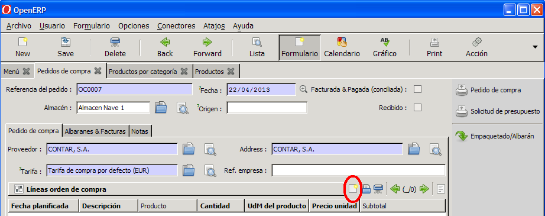

#### Afegir productes a sol·licitud de pressupost

Es selecciona el botó nou  de l'apartat
**línia de ordre de compra**

El producte que es vol comprar ha d'estar degudament introduït a la base de
dades de productes amb totes les dades omplertes correctament.

I a la imatge següent es pot observar com es
selecciona el producte a comprar i s'omple la línia de la sol·licitud de
compra. Es marca en vermell els camps que ha d'omplir l'usuari.

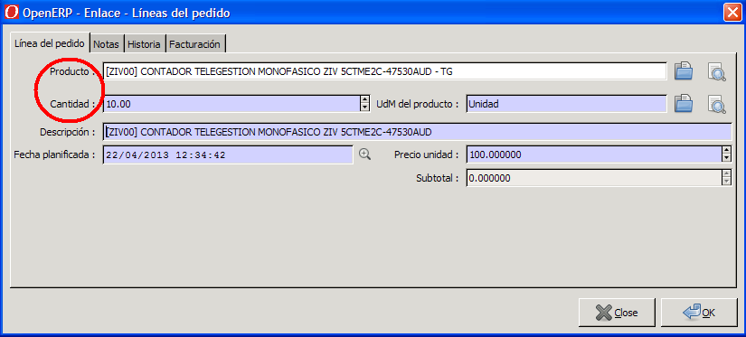

#### Omplir línia de compra

* **Producte**: Amb la lupa es selecciona el producte desitjat. Poden
  utilitzar-se els filtres necessaris per filtrar (**categoria**,
  **proveïdor**, etc..) per una localització més fàcil dels productes.
* **Quantitat**: S'ha d'indicar les unitats d'aquest producte que es desitja
  comprar.
  Poden introduïrse tantes línies de compra com es desitgi a cada ordre de
  compra.

Prement el botó **Calcular** es mostrarà el cost total previst de la compra a
partir dels preus de compra introduïts a la base de dades.

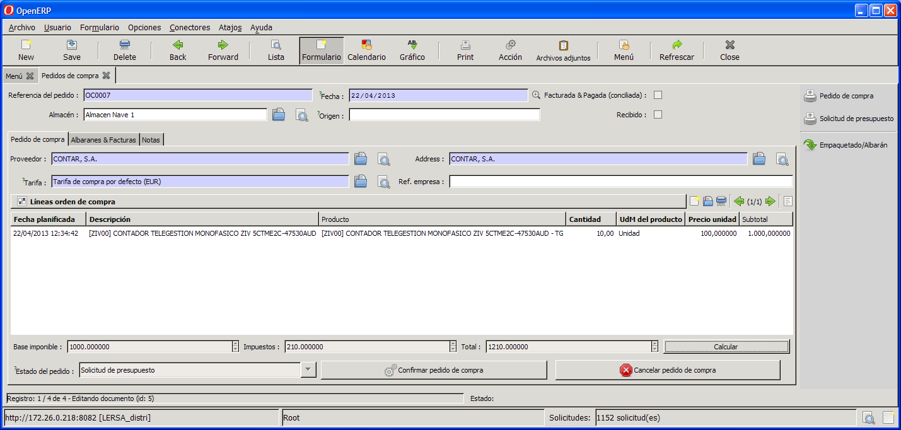

#### Ordre de compra a punt per confirmar

Un cop introduïdes totes les línies de sol·licitud de compra i confirmats els
preus de compra es pot prèmer el el botó **Confirmar comanda de compra**

!!! note
    Es pot anul·lar posteriorment si es decideix no realitzar-la prement el botó
    **Cancel·la comanda de compra**

Un cop confirmada, es pot veure com l'estat de la comanda ha passat de l'estat
**Petició de pressupost** a **confirmat** tal com es veu a la casella **Estat
de la comanda**

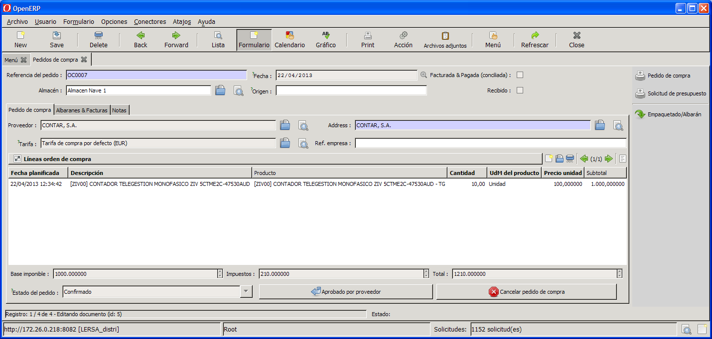

#### Ordre de compra confirmada

Podem accedir posteriorment a les comandes confirmades a la opció de menú
**Compres > Comandes de compra > Comanda de compra esperant aprovació** on es
llistaran totes les comandes confirmades que esperen l'aprovació per part del
proveïdor, confirmació de preus de compra, disponibilitat de productes, etc...

#### Menú de comandes de compra. Esperant aprovació

Podem veure el llistat de totes les ordres de compres
que estan esperant la confirmació per part del proveïdor

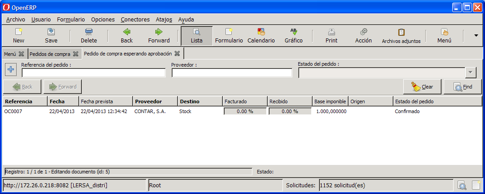

#### Llistat de  comandes de compra pendents d'aprovació

Fent doble clic sobre l'ordre de compra, es mostrarà en format formulari.

Un cop fetes les gestions amb el proveïdor i es consensuin els preus amb la
companyia, ja es pot prèmer el botó **Aprovada pel proveïdor**

Mentre no es premi el botó **Aprovada pel Proveïdor** s'és a temps de modificar
el preu dels productes o les seves quantitats.

Un cop s'ha apretat el botó, l'ordre de compra passa a l'estat de **ordres de
compra en procés**. Totes aquestes comandes les veurem al llistat accessible
des del menu **Compres > Comandes de compra > Comandes de compra en procés**

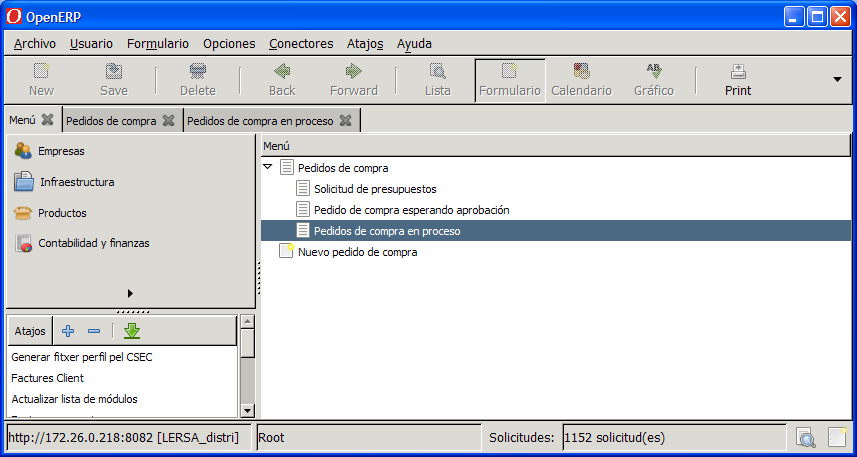

#### Menu de comandes de compra. En procés

Obtindrem el llistat de totes les ordres de compra que
han estat aprovades.

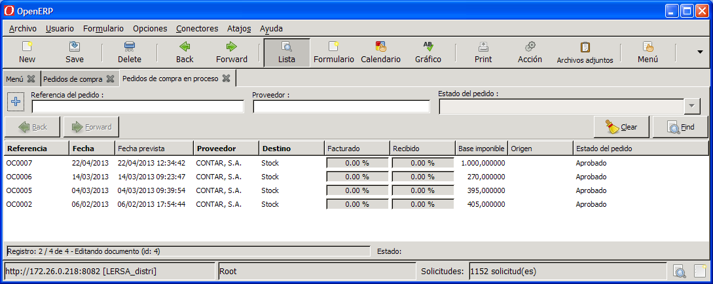

#### Llistat de comandes de compra en procés

L'ordre de compra encara es pot cancel·lar. Per fer-ho accedim a l'ordre de
compra i premem el botó **Cancel·la comanda de compra**

#### Cancel·lar ordre de compra en procés

### Recepció de material amb número de sèrie

Accedim a l'*ordre de compra en procés* per realizar-ne la recepció fent
doble-click.

#### Ordre de compra a punt per rebre el material

Quan arriba l'albarà amb el material al magatzem es procedeix a la seva
recepció prement al botó de la part superior dreta **Paquet/Albarà**

Obtindrem el formulari amb la línia de paquets que es mostra a la figura
següent:

#### Linies de paquets d'un albarà

Prement sobre la línia de recepció de paquets obtindrem finalment la fitxa per
omplir les dades de la recepció del material.

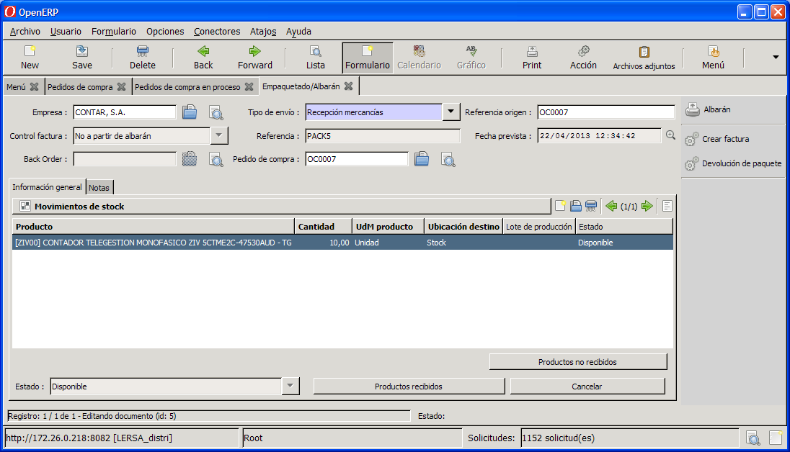

#### Fitxa de recepció de material

Aquesta fitxa conté un seguit de camps a títol informatiu:

* **Ref. origen**: És el codi d'albarà en el qual ha arribat el material, per
  defecte GISCE-ERP li assigna una referència de la comanda
* **Data prevista**: Data en la qual es fa la recepció del material. No es pot
  modificar.
* **Tipus d'enviament**: Quan el material arriba del proveïdor, sempre és
  **Recepció mercaderies**

Fent doble-click sobre la línia del material, apareix la fitxa per fer la
recepció :

##### Fitxa recepció de línia de material

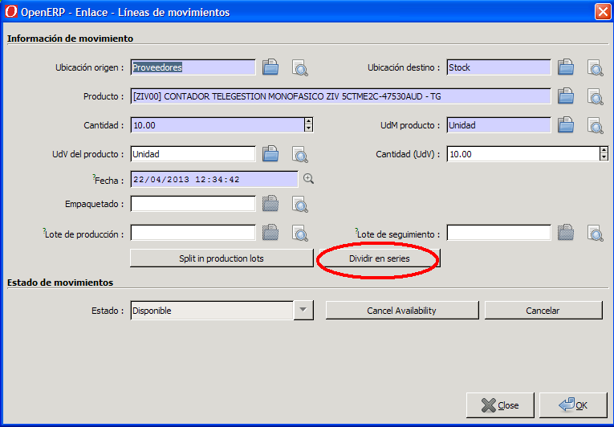

Per fer la recepció del material, podem fer-ho segons diferents casos:

### Cas 1: Tots els comptadors amb número de sèrie correlatius

Suposem que els 10 comptadors d'una comanda tenen número de sèrie consecutius
del 10000001 al 10000010.

Premem el botó **Dividir en sèries** i es crearan 10 línies cadascuna amb un
comptador i el seu número de sèrie, quedant la recepció de material tal com es
veu en la imatge següent:

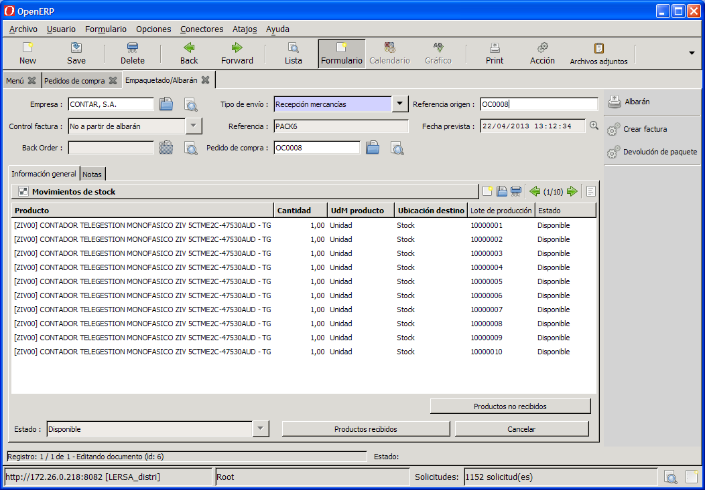

#### Fitxa recepció material dividida en 1 sèrie correlativa (Cas 1)

Per acabar, prement el botó **Productes rebuts** apareixerà el cuadre de diàleg
següent:

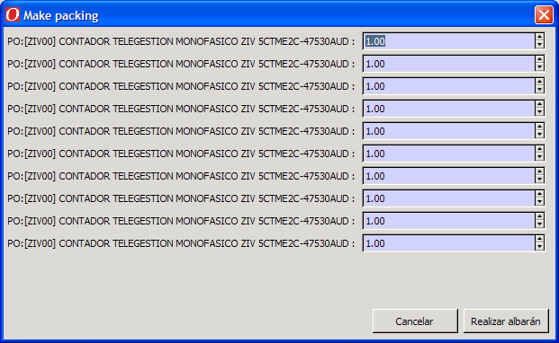

#### Productes rebuts (Cas 1)

Prement el botó **Crear albarà** es donarà el procés de recepció de material
per acabat, passant a estat **realitzat**

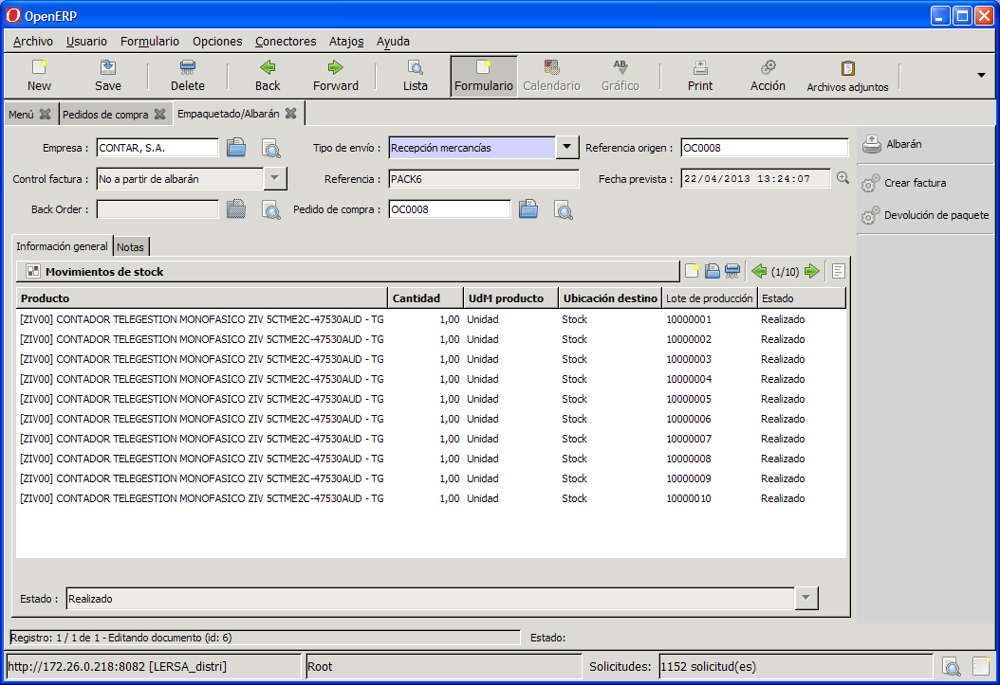

#### Fitxa recepció material en estat realitzat (Cas 1)

### Cas 2: Comptadors amb 2 grups de número de sèrie correlatius

Estem en aquest cas quan la recepció del material sigui parcial o bé que els
números de sèrie no siguin correlatius.

Suposem que arriben 4 comptadors amb número de sèrie correlatiu 10000100 al
10000104, i un altre grup de 6 comptadors amb els números de sèrie de 20000200
al 20000206.

Es procedirà de la següent forma:

Des de la [fitxa de recepció de material](#fitxa-recepcio-de-linia-de-material) haurem de
dividir la línia de 10 comptadors en dues línies, una de 6 comptadors i una
altra de 4 comptadors. Seleccionem la línia i premem el botó d'**acció**
 i del menú que apareix seleccionem
la opció **Divideix línia de moviment**

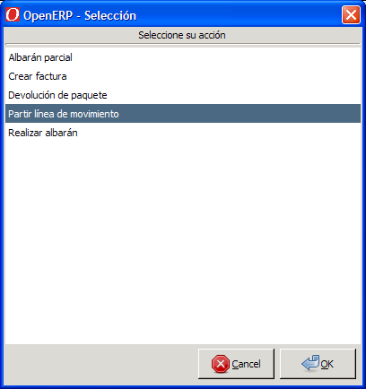

#### Menú acció

A la casella blava haurem d'indicar quants comptadors tenen número consecutiu,
(en el nostre exemple indicarem *6*) i prèmer el botó **Dividir**

#### Partició de línies

El resultat serà que es crearan 2 línies a la
[fitxa empaquetat/albarà](#fitxa-recepcio-de-linia-de-material). Apareixeràn
les dues línies al fer doble-click sobre la línia.

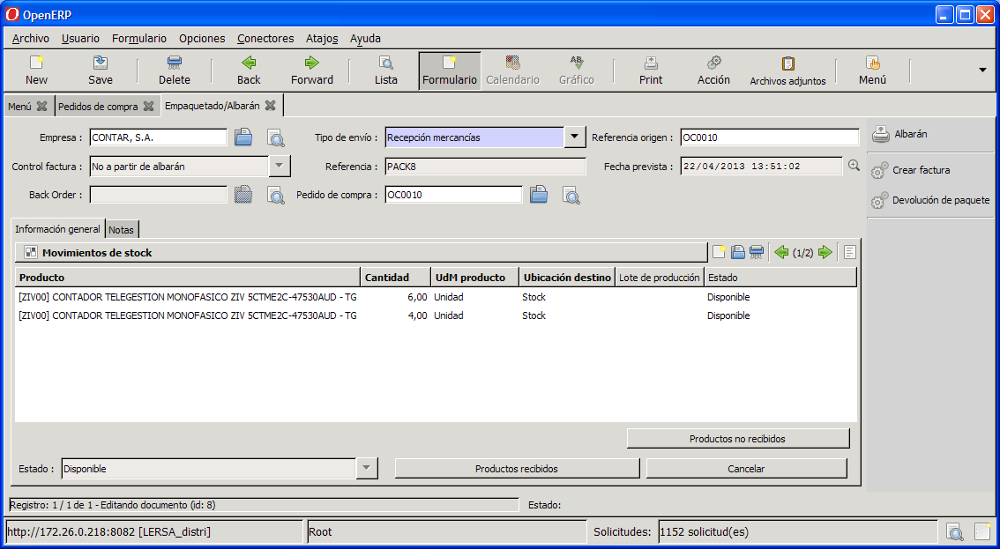

#### Recepció de material partida en dues línies (Cas 2)

Un cop divit l'**Empaquetat/Albarà** es procedirà com en el
[cas 1](#cas-1-tots-els-comptadors-amb-numero-de-serie-correlatius) per cada
una de les linies creades.

Es pot fer d'aquesta forma si no hi ha recepcions parcials de material.

En el cas de comandes que arriben amb diferents albarans d'entrega, el procés
es realitza com en el
[cas 2](#cas-2-comptadors-amb-2-grups-de-numero-de-serie-correlatius).
