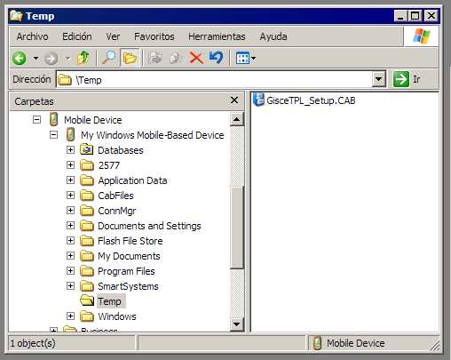
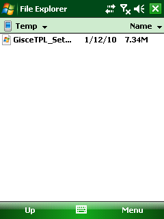
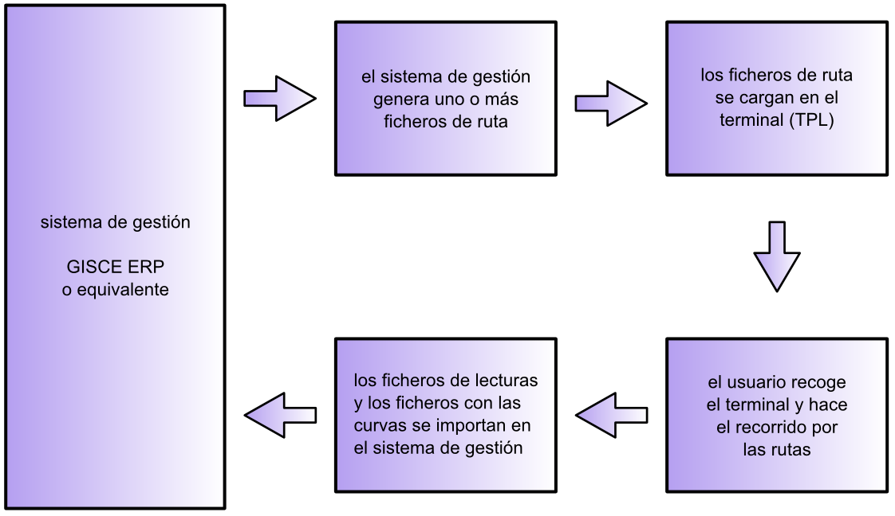
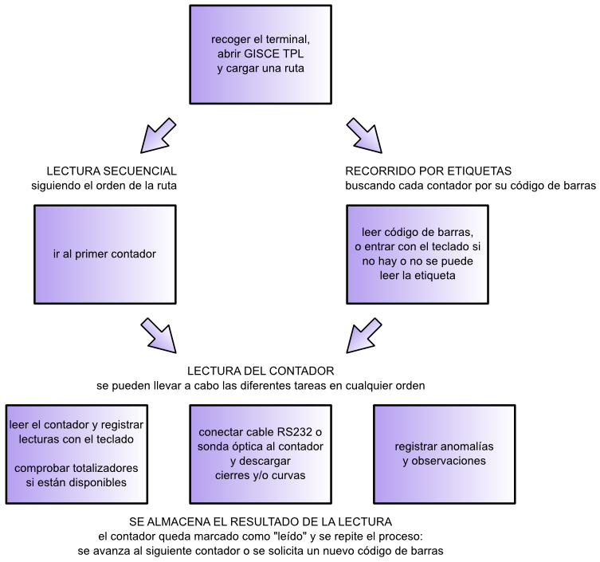

# Manual d'ús de GISCE-TPL

**Índex**

1. [Objecte](#objecte)
2. [Normativa](#normativa)
3. [Termes i definicions](#termes-i-definicions)
4. [Requeriments del sistema i instal·lació](#requeriments-del-sistema-i-installacio)
	1. [Requeriments del sistema](#requeriments-del-sistema)
	2. [Instal·lació](#installacio)
5. [Procés de treball](#proces-de-treball)
	1. [Introducció](#introduccio)
	2. [Fluxorames de processos](#fluxorames-de-processos)
	3. [Organització dels fitxers d'intercanvi en el TPL](#organitzacio-dels-fitxers-dintercanvi-en-el-tpl)
	4. [Menú de Gestió de Rutes](#menu-de-gestio-de-rutes)
	5. [Presa de Lectures de forma Manual](#presa-de-lectures-de-forma-manual)
	6. [Incidències i Observacions](#incidencies-i-observacions)
	7. [Menú Navegació](#menu-navegacio)
	8. [Buscar un comptador](#buscar-un-comptador)
	9. [Avisos i situació del Punt de Mesura](#avisos-i-situacio-del-punt-de-mesura)
6. [Descàrrega electrònica de Tancaments i Curves](#descarrega-electronica-de-tancaments-i-curves)
	1. [Descàrrega automàtica pel Port Òptic](#descarrega-automatica-pel-port-optic)
7. [Fitxers d'intercanvi per GISCE-TPL](#fitxers-dintercanvi-per-gisce-tpl)
	1. [Especificacions comuns a tots els fitxers](#especificacions-comuns-a-tots-els-fitxers)
	2. [Codificació dels camps Data/Hora](#codificacio-dels-camps-datahora)
	3. [Codificació del camp "_Configuración Puerto_"](#codificacio-del-camp-configuracion-puerto)
	4. [Codificació del camp "_Calidad_"](#codificacio-del-camp-calidad)
	5. [Fitxer de Ruta (GISCE-ERP → GISCE-TPL)](#fitxer-de-ruta-gisce-erp-gisce-tpl)
	6. [Fitxer de Lectures (GISCE-TPL → GISCE-ERP)](#fitxer-de-lectures-gisce-tpl-gisce-erp)
	7. [Fitxer de corbes (GISCE-TPL → GISCE-ERP)](#fitxer-de-corbes-gisce-tpl-gisce-erp)
	8. [Catàleg d'anomalies](#cataleg-danomalies)
	9. [Catàleg de situacions](#cataleg-de-situacions)
	10. [Catàleg d'Avisos](#cataleg-davisos)
8. [Fitxers d'intercanvi entre GISCE-TPL i GISCE-ERP](#fitxers-dintercanvi-entre-gisce-tpl-i-gisce-erp)
	1. [Exportació del fitxer de Rutes](#exportacio-del-fitxer-de-rutes)
	2. [Exportació del fitxer de Lectures](#exportacio-del-fitxer-de-lectures)

## Objecte

Aquest manual descriu la aplicació "GISCE-TPL", que serveix per recollir les
lectures d'un o més conjunts d'equips de mesura, tant de forma manual
com de forma automàtica utilitzant els ports sèrie del equip
de mesura òptic o DB-9 amb el protocol IEC-870.

## Normativa

Reglament de punts de mesura. Protocol de comunicacions entre registradors i
concentradors de mesures o terminals portàtils de lectures. Protocol
**IEC870REE** definit per _Red Elèctrica de España_:

Norma internacional **IEC 870-5-102**, tal com apareix en la edició de _1996_.

ORDRE **ITC/1723/2009** del 26 de Juny, per la que es revisen els petges
d'accés a partir de 1 de juliol de 2009 i les tarifes i primes de determinades
instal·lacions de règim especial.

"**_Tablas de codigos\_CNE\_V\_11\_(220109).doc_**", i es pot modificar o
ampliar fàcilment, apartat "**Fitxers d'intercanvi**"

## Termes i definicions

En la descripció del procés d'obtenció dels indicadors de _Continuitat de
Subministre_ apareixen alguns termes amb les següents definicions:

- **TPL**: Corresponen a "_Terminal Portàtil de Lectura_", i en aquest manual
  es refereix a un _ordinador portàtil_ o una _PDA_ basats en _Windows Mobile_;
  Per a les lectures automàtiques es necessita un terminal amb un port sèrie
  **RS232**.
- **Punt de mesura**: El lloc concret de la xarxa on s'ubica l'equip de mesura
- **Ruta**: Consisteix en una col·lecció de _punts de mesura_, disposats en un
  ordreapropiat perquè una persona els recorri tots per dur a terme alguna
  feina, per exemple, en el cas que ens ocupa, recollir les lectures i/o corbes
  de la càrrega.
- **Ordre** Es el lloc que ocupa un _punt de mesura_ dins
  d'una _ruta_ de lectura.
- **Avís comptador**: Es denomina _avís_ a qualsevol advertència que es
  realitza al operador de _TPL_ i que hauria de hauria de tenir en compte abans
  de realitzar la lectura d'un determinat _equip de mesura_.
- **Situació comptador**: Es la informació referida a un punt de mesura per la
  seva fàcil localització i que serveix d'ajuda al operador de _TPL_ per
  localitzar l'_equip de mesura_.

## Requeriments del sistema i instal·lació

### Requeriments del sistema

GISCE-TPL funciona en qualsevol _PDA_ amb _Pocket PC 2003_
o superior (_incloent Windows Mobile_).

La instal·lació i càrrega de rutes i descàrrega de lectures pot realitzar-se
connectant la _PDA_ amb _l'ordinador personal_, normalment per _USB_,
o amb una tarjeta extraible de memòria.

Per recollir _lectures electròniques_ el terminal ha de tenir accés als
**accessoris necessaris per conectar-lo al comptador**:

- **Adaptador a port sèrie**, per connectar amb un cable sèrie, amb DB9 en els
  dos extrems, o amb DB9 en el costat del TPL i capsal òptic en el
  costat del comptador.
- **Adaptador a port USB**, per a connectar una sonda òptica USB

### Instal·lació

S'ha de copiar l'arxiu **GisceTPL_Setup.CAB** en alguna carpeta del TPL
(veure per exemple la següent figura, en \Temp).

**GisceTPL_Setup.CAB:**    
Localitzar i "executar" des del TPL el fitxer que s'acaba de copiar;
començarà la instal·lació.

**Instal·lació:**    
S'ha d'indicar que es desitja instal·lar el programa en la memòria principal
del dispositiu, i no en tarjetes extraibles

**Instal·lació:**
Quan la instal·lació finalitzi, el TPL ens informarà de que s'ha
realitzat correctament.

**Inici de la aplicació GISCE-TPL:**    
En l'apartat **Inici / Programes** aparaixerà l'icona de GISCE-TPL.
Per poder iniciar el programa cal tocar executar-lo.

## Procés de treball

### Introducció

El concepte "_ruta_" consisteix en una col·lecció de comptadors, disposats en
un ordre apropiat perquè una persona els recorri tots per a dur a terme alguna
feina. Per exemple, en el nostre cas, recollir lectures.

El sistema "_GISCE-ERP_" contempla aquest concepte, i genera un _fitxer de ruta_
(text delimitat per tabuladors, en un fitxer amb l'extensió _.ruta_. Veure
l'apartat [Fitxers d'intercanvi](#fitxers-dintercanvi-per-gisce-tpl)) que
conté les dades dels comptadors en l'ordre que s'hagi establert per
anar recollint les lectures.    
**Aquest fitxer inclou les dades necessàries per identificar el comptador,
la pòlissa, l'abonat, el CUPS, i els valors de lectures anteriors**.

L'aplicació "GISCE-TPL" utilitza aquest _fitxer de ruta_ com entrada.
Permet al usuari anar entrant les lectures per cada comptador, i genera com a
resultat un _fitxer de lectures_, que conté les dades recollides.

El _fitxer de lectures_ resultant es processa en el sistema "GISCE-ERP",
actualitzant la base de dades amb la informació recollida i permetent revisar
les incidències que s'han registrat.

Encara que l'aplicació "GISCE-TPL" està pensada per funcionar integrada en el
flux de treball del sistema "GISCE-ERP", es completament autònoma. Els formats
de tots els fitxers de dades estàn descrits formalment en l'apartat
"_fitxers d'intercanvi_" i poden ser utilitzats amb qualsevol altre
aplicació de gestió.

### Fluxorames de processos

Per començar el recorregut per la ruta s'ha de disposar d'un o més _fitxers
de ruta_. Aquests s'obtenen, generalment, accedint al mòdul de lectures de
GISCE-ERP: l'apartat que permet exportat el fitxer de ruta sol·licita que
es seleccioni una ruta i també la data en la que es van recollir les lectures.

S'haurà de disposar del terminal que es va utilitzar durant el recorregut,
que obviament haurà de tenir instal·lada la aplicació "GISCE-TPL".

S'han d'introduir els fitxers de ruta en el terminal. Això es pot realitzar
guardant els fitxers en una targeta tipus _flash_, per exemple una _targeta SD_,
si el terminal ho permet. Es poden introduir directament en el terminal
conectant-lo al ordinador amb _ActiveSync_.    
S'ha de tenir en compte que GISCE-TPL generarà un _fitxer de lectures_ per
cada _ruta_ i aquest quedarà en la mateixa ubicació en la que es trobi el
_fitxer de ruta_ corresponent.

L'usuari s'emportarà el terminal amb ell. Es convenient probar a obrir cada
_fitxer de ruta_ abans d'entregar el terminal al usuari, per tal d'evitar, en la
mesura del possible, que es trobi amb problemes en el carrer.

Per iniciar el procés, s'haurà d'obrir la aplicació "GISCE-ERP". El menú
principal de la aplicació permet seleccionar un dels _fitxers de ruta_
disponibles en el terminal. El procés de càrrega s'assegura de que totes les
dades que hi ha en el _fitxer de ruta_ siguin correctes.    
A continuació informa del nombre de comptadors que hi ha en la ruta.

Si s'haguessin recollit ja lectures en la ruta, els resultats del _fitxer de
lectures_ corresponent es carreguen automàticament.    
El terminal ens mostrarà el número de comptadors pendents de llegir i podrem
consultar les lectures ja recollides "navegant" pels diferents comptadors.

Per a les lectures manuals, existeix la possibilitat d'etiquetar amb un
**codi de barres** els comptadors. Això ens permet avançar per la ruta
de dos maneres diferents:

El programa solicita el _codi del comptador_ que es va llegir. Idealment
s'introdueix amb el lector de codis de barres. "GISCE-TPL" localitza el
comptador en la ruta i a continuació, sol·licita les lectures dels diferents
paràmetres segons el tipus de tarifa.    
Quan s'han entrat totes les dades per al comptador, l'aplicació sol·licita
un nou _codi de comptador_.    
Es segueix el recorregut previst en la ruta, introduint els paràmetres a llegir
de cada comptador. El programa avança automàticament al següent comptador de
la ruta quan s'ha acabat la lectura del actual.

En tots dos casos, segons es van recollint les lectures de la ruta, el programa
va emmagatzemant les lectures introduïdes en el fitxer de lectures. Si
s'interromp el procés, per exemple tencant el programa a mitja ruta,
només farà falta tornar a carregar la ruta per poder rependre
el treball on es va deixar.

Les lectures es poden recollir de dos maneres:

- _Manualment_, llegint en el comptador i registrant cada una de les magnituds
- _Electrònicament_, mitjançant una connexió del TPL al comptador utilitzant
  un cable sèrie _RS232_ o una _sonda òptica_.

La aplicació sempre dona la possibilitat d'anotar observacions per cada
comptador. Adicionalment es pot indicar una de les anomalies tipificades,
seleccionant-la d'una llista, per exemple en cas de detectar un frau, defectes
en la instal·lació, no poder accedir al aparell...    
Aquesta llista està basada en la _tabla 63_ del document
"_tablas de codigos\_CNE\_V\_11\_(220109).doc_" i es pot modificar o ampliar
fàcilment (Veure l'apartat [Fitxers d'intercanvi](#fitxers-dintercanvi-per-gisce-tpl))

L'aplicació permet a més a més: buscar, avançar i retrocedir per els comptadors
de la ruta; per revisar en cas de dubte i corretgir les dades ja entrades si
fos necessari.

L'últim pas consisteix en recollir els _fitxers de lectures_ resultatns i
processar-los segons sigui oportú.    
Per recollir els fitxers de lectures s'utilitza el mateix mètode que per
introduïr els _fitxers de ruta_: es pot insertar la targeta _flash_ al ordinador
o bé es pot connectar el terminal amb _ActiveSync_.

GISCE-ERP ofereix la funció d'importar les lectures recollides.    
Analitzarà els fitxers de lectures i actualitzarà la Base De Dades deixant les
dades llestes per altres processos, per exemple perfilat i facturació. També es
podrà revisar els comptadors marcats amb anomalies i els que s'han registrat
amb observacions.

### Organització dels fitxers d'intercanvi en el TPL

### Menú de Gestió de Rutes

### Presa de Lectures de forma Manual

### Incidències i Observacions

### Menú Navegació

### Buscar un comptador

### Avisos i situació del Punt de Mesura

## Descàrrega electrònica de Tancaments i Curves

### Descàrrega automàtica pel Port Òptic

## Fitxers d'intercanvi per GISCE-TPL

### Especificacions comuns a tots els fitxers

### Codificació dels camps Data/Hora

### Codificació del camp "_Configuración Puerto_"

### Codificació del camp "_Calidad_"

### Fitxer de Ruta (GISCE-ERP → GISCE-TPL)

### Fitxer de Lectures (GISCE-TPL → GISCE-ERP)

### Fitxer de corbes (GISCE-TPL → GISCE-ERP)

### Catàleg d'anomalies

### Catàleg de situacions

### Catàleg d'Avisos

## Fitxers d'intercanvi entre GISCE-TPL i GISCE-ERP

### Exportació del fitxer de Rutes

### Exportació del fitxer de Lectures
