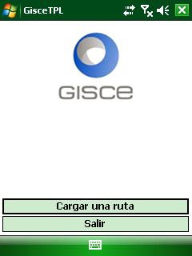
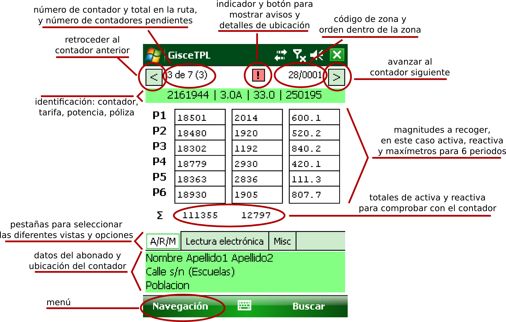
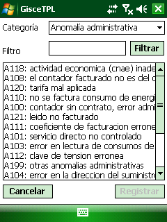
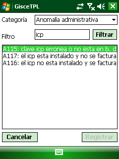
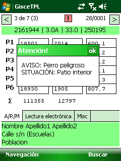

# Introducció

El concepte "_ruta_" consisteix en una col·lecció de comptadors, disposats en
un ordre apropiat perquè una persona els recorri tots per a dur a terme alguna
feina. Per exemple, en el nostre cas, recollir lectures.

El sistema "_GISCE-ERP_" contempla aquest concepte, i genera un _fitxer de ruta_
(text delimitat per tabuladors, en un fitxer amb l'extensió _.ruta_. Veure
l'apartat [Fitxers d'intercanvi](intercanvi_tpl.md)) que
conté les dades dels comptadors en l'ordre que s'hagi establert per
anar recollint les lectures.    
**Aquest fitxer inclou les dades necessàries per identificar el comptador,
la pòlissa, l'abonat, el CUPS, i els valors de lectures anteriors**.

L'aplicació "GISCE-TPL" utilitza aquest _fitxer de ruta_ com entrada.
Permet al usuari anar entrant les lectures per cada comptador, i genera com a
resultat un _fitxer de lectures_, que conté les dades recollides.

El _fitxer de lectures_ resultant es processa en el sistema "GISCE-ERP",
actualitzant la base de dades amb la informació recollida i permetent revisar
les incidències que s'han registrat.

Encara que l'aplicació "GISCE-TPL" està pensada per funcionar integrada en el
flux de treball del sistema "GISCE-ERP", es completament autònoma. Els formats
de tots els fitxers de dades estàn descrits formalment en l'apartat
"_fitxers d'intercanvi_" i poden ser utilitzats amb qualsevol altre
aplicació de gestió.

# Fluxorames de processos

Per començar el recorregut per la ruta s'ha de disposar d'un o més _fitxers
de ruta_. Aquests s'obtenen, generalment, accedint al mòdul de lectures de
GISCE-ERP: l'apartat que permet exportat el fitxer de ruta sol·licita que
es seleccioni una ruta i també la data en la que es van recollir les lectures.

S'haurà de disposar del terminal que es va utilitzar durant el recorregut,
que obviament haurà de tenir instal·lada la aplicació "GISCE-TPL".

S'han d'introduir els fitxers de ruta en el terminal. Això es pot realitzar
guardant els fitxers en una targeta tipus _flash_, per exemple una _targeta SD_,
si el terminal ho permet. Es poden introduir directament en el terminal
conectant-lo al ordinador amb _ActiveSync_.    
S'ha de tenir en compte que GISCE-TPL generarà un _fitxer de lectures_ per
cada _ruta_ i aquest quedarà en la mateixa ubicació en la que es trobi el
_fitxer de ruta_ corresponent.

L'usuari s'emportarà el terminal amb ell. Es convenient probar a obrir cada
_fitxer de ruta_ abans d'entregar el terminal al usuari, per tal d'evitar, en la
mesura del possible, que es trobi amb problemes en el carrer.

Per iniciar el procés, s'haurà d'obrir la aplicació "GISCE-ERP". El menú
principal de la aplicació permet seleccionar un dels _fitxers de ruta_
disponibles en el terminal. El procés de càrrega s'assegura de que totes les
dades que hi ha en el _fitxer de ruta_ siguin correctes.    
A continuació informa del nombre de comptadors que hi ha en la ruta.

Si s'haguessin recollit ja lectures en la ruta, els resultats del _fitxer de
lectures_ corresponent es carreguen automàticament.    
El terminal ens mostrarà el número de comptadors pendents de llegir i podrem
consultar les lectures ja recollides "navegant" pels diferents comptadors.

Per a les lectures manuals, existeix la possibilitat d'etiquetar amb un
**codi de barres** els comptadors. Això ens permet avançar per la ruta
de dos maneres diferents:

El programa solicita el _codi del comptador_ que es va llegir. Idealment
s'introdueix amb el lector de codis de barres. "GISCE-TPL" localitza el
comptador en la ruta i a continuació, sol·licita les lectures dels diferents
paràmetres segons el tipus de tarifa.    
Quan s'han entrat totes les dades per al comptador, l'aplicació sol·licita
un nou _codi de comptador_.    
Es segueix el recorregut previst en la ruta, introduint els paràmetres a llegir
de cada comptador. El programa avança automàticament al següent comptador de
la ruta quan s'ha acabat la lectura del actual.

En tots dos casos, segons es van recollint les lectures de la ruta, el programa
va emmagatzemant les lectures introduïdes en el fitxer de lectures. Si
s'interromp el procés, per exemple tencant el programa a mitja ruta,
només farà falta tornar a carregar la ruta per poder rependre
el treball on es va deixar.

Les lectures es poden recollir de dos maneres:

- _Manualment_, llegint en el comptador i registrant cada una de les magnituds
- _Electrònicament_, mitjançant una connexió del TPL al comptador utilitzant
  un cable sèrie _RS232_ o una _sonda òptica_.

La aplicació sempre dona la possibilitat d'anotar observacions per cada
comptador. Adicionalment es pot indicar una de les anomalies tipificades,
seleccionant-la d'una llista, per exemple en cas de detectar un frau, defectes
en la instal·lació, no poder accedir al aparell...    
Aquesta llista està basada en la _tabla 63_ del document
"_tablas de codigos\_CNE\_V\_11\_(220109).doc_" i es pot modificar o ampliar
fàcilment (Veure l'apartat [Fitxers d'intercanvi](intercanvi_tpl.md))

L'aplicació permet a més a més: buscar, avançar i retrocedir per els comptadors
de la ruta; per revisar en cas de dubte i corretgir les dades ja entrades si
fos necessari.

L'últim pas consisteix en recollir els _fitxers de lectures_ resultants i
processar-los segons sigui oportú.    
Per recollir els fitxers de lectures s'utilitza el mateix mètode que per
introduïr els _fitxers de ruta_: es pot insertar la targeta _flash_ al ordinador
o bé es pot connectar el terminal amb _ActiveSync_.

GISCE-ERP ofereix la funció d'importar les lectures recollides.    
Analitzarà els fitxers de lectures i actualitzarà la Base De Dades deixant les
dades llestes per altres processos, per exemple perfilat i facturació. També es
podrà revisar els comptadors marcats amb anomalies i els que s'han registrat
amb observacions.

# Organització dels fitxers d'intercanvi en el TPL

Els fitxers de ruta s'hauràn de carregar dins del àrea _flash_ del terminal, per
evitar pèrdua de dades en cas de que s'acabi o retiri la bateria del dispositiu,
per exemple si rep un cop.

GISCE-TPL emmagatzemarà els resultats del recorregut (_fitxers de ruta_ i
_fitxers de corbes_) en un directori amb el mateix nom de la ruta.

Tal com es veu en la següent imatge, per la ruta "_CT-108_ " s'ha creat una
carpeta amb el mateix nom de la ruta  que conté els fitxers "_CT-108.lectura_ "
i totes les corbes de càrrega descarregades.

En aquest exemple hi ha tres rutes sense començar: la "04", la "05" i la "14".
Els seus directoris amb els resultats es crearan automàticament quan es comenci
el recorregut per cadascuna.

Per traslladar els resultats al sistema de gestió, per exemple GISCE-ERP, només
caldrà recuperar les carpetes amb els resultats i importar-los.    
(Veure l'apartat
[Fitxers d'intercanvi](intercanvi_tpl.md))

# Menú de Gestió de Rutes

**Menú principal**    
Quan obrim l'aplicació "GISCE-TPL" apareix el menú principal en el que permet
escollir la ruta de lectura que es desitja carregar polsant el botó
_Cargar Una Ruta_.

**Cargar una ruta de lectura**    
En el quadre de diàleg, apareixen tots els fitxers de ruta (fitxers amb
l'extensió "**.ruta**" que es troben en qualsevol carpeta del TPL).    
Fent doble click sobre la ruta, aquesta es carrega i permet la navegació
per els registres de la ruta.

Una vegada carregada la ruta que es desitja llegir, apareix el menú
de navegació i gestió de rutes. Podem trobar diverses funcions:

- **_Ir al primer contador pendiente_**
  Permet situar-se en el primer registre de la ruta del que encara
  no s'ha pres la lectura.
- **_Ir al primer contador_**    
  El programa de lectures es situa en el primer comptador de la ruta,
  tingui o no lectures
- **_Cargar otra ruta_**    
  Igual que en la primera imatge d'aquest apartat.
- **_Salir_**    
  Sortir de l'aplicació de GISCE-TPL

# Presa de Lectures de forma Manual

GISCE-TPL mostra els diferents formularis per la recollida de lectures, que
varien en funció de la tarifa associada a la pòlissa, com es veurà en els
pròxims apartats.

Una pantalla tipus, per la entrada de dades manuals, es tal i com es mostra
en la següent imatge, on es descriu cadascún dels seus apartats:

A continuació es descriuen els diferents apartats que es mostren durant la
presa de dades d'un equip de mesura.

Es mostra informació associada a cada comptador en la ruta, per ajudar a
identificar els comptadors i, en la mesura del possible, minimitzar
equivocacions i detectar anomalies.

De dalt a baix, i d'esquerra a dreta:

- **Botó retrocedir**    
  Permet moure's endarrera, mostrant els registres anteriors i els valors de
  les mitjanes si ja s'han pres.
- **Número de comptador dins de la ruta**
- **Número total de comptadors en la ruta**
- **Número de comptadors pendents de processar**, entre parèntesis.
- **Símbol d'advertència**
  Avisa de l'existència d'un avís o situació en el punt de mesura actual.
- **Codi de la zona i ordre dins de la zona**
  Mostra el valor de la ruta activa amb l'ordre de lectura associat
  a cada registre
- **Botó avançar**
  Permet moure's cap endavant mostrant els registres anteriors i els valors
  de les mesures si han estat presos.

En l'àrea verda que hi ha just a sota dels botons de navegació, mostra les
dades del equip de mesura en el que es troba el lector:

- **Identificador del comptador**    
  Normalment és el número de sèrie del comptador, de la mateixa manera que
  l'assigna GISCE-ERP, o el codi únic que identifica l'equip de mesura.
- **Codi de la _tarifa d'accés_ contractada**
- **Potència contractada**
- **Identificador o Codi de la pòlissa**

En la part central de la pantalla, apreixen caselles per a l'entrada de valors
de diferents magnituds i periodes per a **l'entrada de lectures**

**Totalitzador**    
Sota les caselles d'entrada de dades, en les lectures de 6 periodes apareix el
sumatori dels valors introduis perquè es comprovin amb el valor del
totalitzador del equip de mesura.

Les diferents "pestanyes" permeten accedir als diferents formularis del
comptador actual. Les magnituds a llegir del comptador apareixen, en funcio del
_tipus de tarifa_, en les tres pestanyes que s0acaben de descriure:

- **Lectures**: La pestanya de lectures apareix quan s'està prenent les lectures
  manuals per a tarifes **_2.0A, 2.0DHA, 2.1A i 2.1DHA_**.
- **A/M/R**(Inicials de "Activa/Reactiva/Maxímetre"): la pestanya A/M/R apareix
  per a les tarifes **3.0A, 3.1A i 6.1**.
- **Excessos**: Aquesta pestanya apareix per a les tarifes **6.1**.
- **Lectura electrònica**: S'accedeix a la descàrrega de tancaments i
  corbes de càrrega dels equips de mesura.
- **Misc**: S'introdueixen incidències i observacions de la lectura i
  equips de mesura

En l'àrea verda de la part inferior, just a sota de les pestanyes, mostra:

- **Nom del client**, en la primera línia
- **Direcció**, en la segona línia
- **Població**, en la tercera línia

**Navegació**: Permet accedir al menú de navegació.

- _**Buscar** Comptador_: Permet situar-se en un comptador de la ruta indicant
  el seu codi o bé manualment o bé a partir de la lectura del codi de barres.

## Tarifes de 1 o 2 periodes

**Tarifes**: 2.0A, 2.0DHA, 2.1A i 2.1DHA

La pantalla d'entrada de dades manuals de les tarifes de 1 o 2 períodes es
tal i com es mostra en aquesta imatge.

La columna de l'esquerra mostra la lectura anterior.

Si el valor incremental del consum, obtingut de la diferencia de la lectura
absoluta anterior i la actual, es negatiu es ressalta en vermell. Això serveix
perquè l'operador del equip comprobi si el valor introduït es correcte,
o l'equip de mesura concideix amb el que es desitja realitzar la lectura.

Si el valor incremental del consum es positiu, el valor es mostra ressaltat
utilitzant el color blau.

## Tarifes de 3 i 6 períodes

**Tarifes**: 3.0A, 3.1a i 6.x

La pantalla d'entrada de dades manuals de les tarifes de 3 i 6 períodes es
tal i com es mostra en aquesta imatge. Les tarifes de 3 períodes es llegeixen
igualment en 6 per tenir en compte els períodes dels dies festius.

- **Pestanya A/R/M**: S'introdueixen els valors de l'energia Activa (A),
  Reactiva (R) i el Maxímetre (M)

En la part inferior de les columnes d'Activa i Reactiva apareix la suma de tots
els valors per comprobar-los amb el valor del totalitzador del equip de mesura.

Si es desitja fer la lectura electrònica a través del port òptic s'ha de polsar
sobre la pestanya "Lectura electrónica". (Veure apartat [Descàrrega electrònica
de tancaments i corbes](decarrega_tancaments_i_curves.md))

**Tarifa**: 6.x

- **Pestanya Excesos**: En aquesta pestanya s'introdueixen els excessos de
  consum registrats en l'equip de mesura.

Si es desitja fer la lectura electrònica a través del port òptic s'ha de polsar
sobre la pestanya "Lectura electrónica". (Veure apartat [Descàrrega electrònica
de tancaments i corbes](decarrega_tancaments_i_curves.md))

# Incidències i Observacions

La pestanya **Misc** (de _miscelània_) permet registrar incidències i anotar les
observacions que l'usuari cregui oportunes.

- _Registrar anomalia_, permet seleccionar una de els anomalies tipificades
    - Apareix la finestra que es mostra en les dos imatges de més a la dreta.
    - Es pot escollir directament de la llista completa o buscar amb el filtre.
- _Sol·licitar etiqueta_, en cas de qie els comptadors estiguin etiquetats amb
  codis de barres, l'usuari pot indicar que el comptador actual necessita una
  nova etiqueta.
  Es marcarà la casella en cas de que s'hagi de generar una nova etiqueta de
  codi de barres si l'existent està en mal estat.
- _Observacions_, permet al usuari registrar qualsevol comentari que cregui
  oportú. S'hi inclouràn els nous avisos per a pròximes lectures, la situació
  del equip de mesura o qualsevol informació d'interés per la companyia

- _Llista d'anomalies_, permet seleccionar la categoria i escollir directament
  de la llista completa o buscar amb el filtre. Una vegada localitzada
  l'anomalia, es sel·lecciona i es polsa el botó _Registrar_ perquè es guardi
  en la Base de Dades.

- _Filtre d'anomalies_, dins de la finestra de la llista d'anomalies, una vegada
  ja hem sel·leccionat una categoria, podem escriure dins de la casella de
  _Filtre_ la cadena de caràcters que volem buscar. Quan ja haguem escrit
  la cadena, prement el botó _Filtrar_, la llista d'anomalies es reduirà a les
  que compleixen el filtre.

# Menú Navegació

Polsant sobre el menú "_Navegación_" permet al operador canviar la forma de
navegar per la ruta en qualsevol moment seleccionant qualsevol de les opcions
existents.

- **Solo contadores pendientes**. Omet els comptadors que ja s'han llegit i
  únicament mostra els que estàn pendents de llegir.
- **Todos los contadores**. Mostra tots els comptadors amb lectures realitzades
  per a la seva verificació.
- **Navegación por etiquetas**. Permet canviar a la realització de lectures
  entrant el número del comptador o bé manualment o bé utilitzant el lector
  de codi de barres del TPL.

# Buscar un comptador

Polsant el botó "_Buscar_" en la part inferior dreta de la pantalla, o bé des
del menú "_Navegación/Navegación por etiquetas_", s'accedeix a la pantalla de
_**Buscar comptador**_.

En la casella "_Número del contador_" s'hi introduirà el número de comptador
desitjat.

Pot teclejar-se directament el codi del comptador, si aquest disposa de codi de
barres, es pot utilitzar el lector de codi de barres del TPL.

Polsant sobre el botó "_Buscar_" es situarà en el registre desitjat.

Si el codi introduït no correspon a cap comptador de la ruta activa, la casella
es resalta en color vermell i espera a que s'entri un altre codi.

Si té una centralització de comptadors, es molt útil colocar les etiquetes de
codi de barres, generat pel programa GISCE-ERP, en cada comptador. Això
facilitarà i agilitzarà la lectura dels equips de mesura, millorant així la
eficiència dels treballs de presa de mesures.

# Avisos i situació del Punt de Mesura

**Advertència**: Quan apareix el símbol '[!]' d'advertència, significa que hi ha
algun avís referent a les precaucions o accions a tenir en compte pe a la presa
de lectues, o bé alguna observació referida a la situació del comptador per a la
seva fàcil localització.

Polsant sobre el botó d'advertència es podrà veure l'avís i/o situació referent
a aquest punt de mesura.

Si es desitja afegir algun avís o advertència, s'ha d'indicar en l'apartat
d'_observacions_, perquè el departament d'administració ho afegeixi per la
pròxima presa de lectures.
