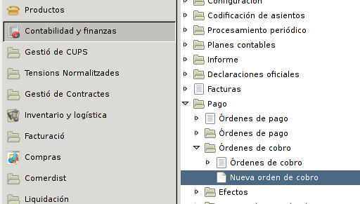

# Creació de remesa

El primer pas per crear una remesa és crear el que OpenERP anomena "Órdenes de
cobro". Pre crear-la, accedim al menú "Contabilidad y finanzas / Pago / Órdenes
de cobro / Nueva orden de cobro" com es veu a la següent figura.

Nova "Orden de cobro":

Un cop creada, cal omplir-ne els camps de la fitxa.

Emplenem els camps obligatoris, entre ells el "Modo de pago", que a l'hora
d'afegir factures actuarà de filtre. Llavors guardem.

Si hem seleccionat "Fecha fija" a la "Fecha preferida", cal omplir també a
quina data es programarà el cobrament (camp "Scheduled date if fixed").

Dades obligatòries:

**Descripció dels camps de la fitxa de remesa**

 * *Referència* Camp seqüencial que s'emplena automàticament
 * *Modo de pago* En aquesta casella cal seleccionar el "modo de pago" de les
   factures que es volen incloure a la remesa. Aquest camp actuarà de filtre a
   l'hora d'afegir factures. Només es poden afegirf actures a aquesta remesa
   que tinguin el camp "modo de pago" igual a l'indicat a la remesa.
 * *Fecha preferida* Normalment es seleccionarà "Fecha fija". Indica a quina
   data s'ha de passar el cobrament de la factura.
 * *Scheduled date if fixed* És la data en què el banc passarà el rebut als
   clients, obligatori si a "Fecha preferida" hem seleccionat "Fecha fija".
 * *Usuario* Camp fix en què hi apareix l'usuari de l'ERP que fa la remesa.
 * *Plantilla* Se seleccionarà sempre "Simple"
 * *Tipo* Sempre fix amb valor "A cobrar".
 * *Crear asientos contables* Sempre es deixarà a "Por extracto bancario"

Una vegada omplerts els camps correctament es guarda la remesa i es procedeix a
afegir-hi les factures a remesar.

## Afegir factures a la remesa

Existeixen dues maneres d'afegir factures a una remesa.

## De forma massiva a partir del lot de facturació

Primer accedim al lot de facturació que es vol remesar pel menú "Facturació /
Mercat lliure / Lots de facturació / Lots de facturació".

Obrim el lot de facturació que volguem remesar i apretem el botó "Afegir
factures a remesar". Amb aquest assistent només cal buscar la remesa creada a
l'apartat anterior i després polsar el botó "Afegir factures".

Aquesta operació afegirà a la remesa totes les factures del lot de facturació
que tinguin el "Modo de pago" igual al de la remesa seleccionada. Si es volen
afegir factures que no estaven al lot, es pot fer tal i com s'indica al següent
punt.

Afegir factures a remesa:

Seleccionar remesa:

## De forma manual des de la remesa

Amb el botó "Seleccionar facturas a cobrar" es poden afegir factures que
compleixin els filtres indicats.

Si per error s'afegeix alguna factura a la remesa que no es vol remesar, es pot
eliminar de la remesa polsant el botó d'esborrar petit que hi ha sobre el
llistat de factures a remesar.

## Confirmar remesa

Després de comprovar que hi ha les factures que toca a la remesa, hem d'apretar
el botó "Confirmar pagos".

## Generar fitxer de remesa pel banc

Un cop confirmada la remesa, el següent pas és generar el fitxer per enviar al
banc. Per generar-ho farem clic al botó "Crear fichero de pagos".

## Donar la remesa per pagada

Una vegada generat el fitxer per enviar al banc es donaran per pagades totes
les factures incloses a la remesa polsant el botó "Pagar Remesa".

Totes les factures passaran llavors a estat "Realizado" i el valor residual a
zero amb els corresponents assentaments creats.
